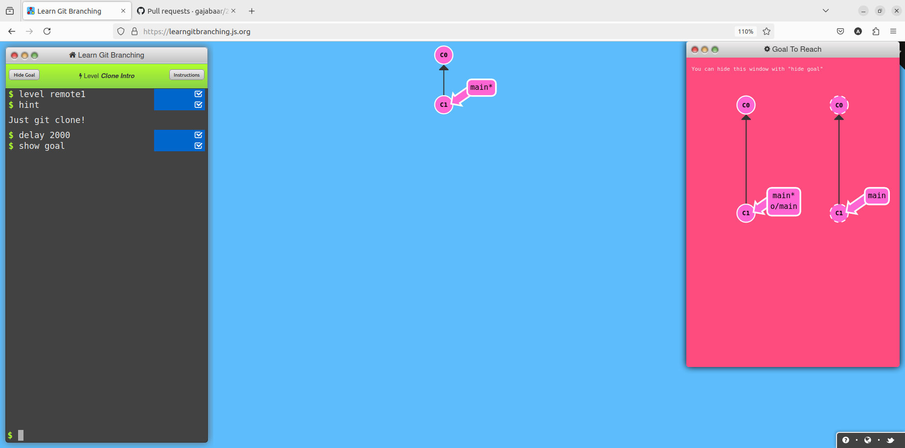
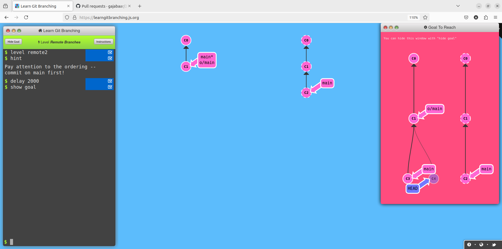
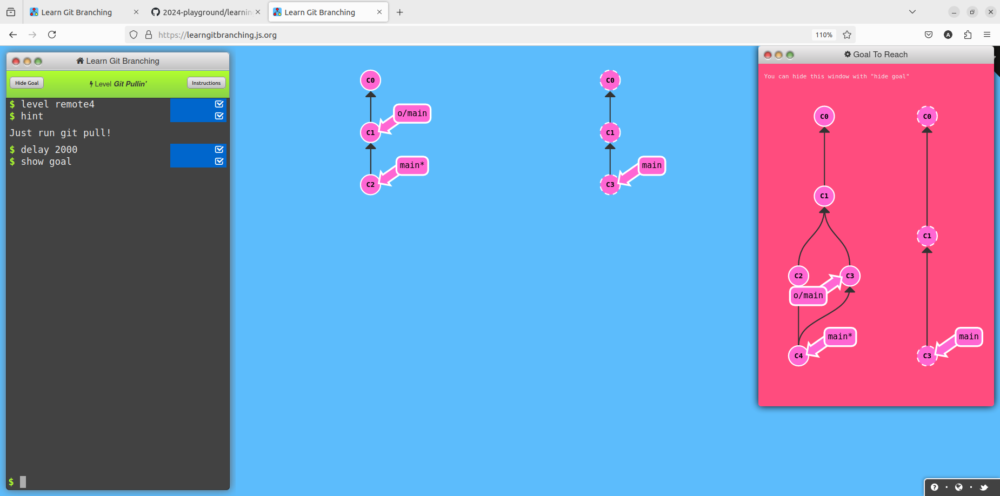

# Writeup of Git Remote Lab
## Push & Pull -- Git Remotes! 
### Level1 Clone Intro
**Goal-** Clone your existing repository 

**Solution**
```
git clone

```
### level2 Remote Branches
**Goal-** commit once in main then in remote branch 

**Solution**
```
git commit
git checkout o/main
git commit

```
### level3 git fetch
**Goal-** use fetch command to download all the commits from remote repository

**Solution**
```
git fetch

```
### Level4git pulling
**Goal-** Synchronize your local branch with remote branch with fetch and merge command

**Solution**
```
git fetch
git merge o/main

```

### Level5 Faking Teamwork
**Goal-** clone your remote repository,make changes on remote by faking teamwork and then fetch and merge

**Solution**
```
git clone
git fakeTeamwork main 2
git commit
git fetch
git merge o/main

```

