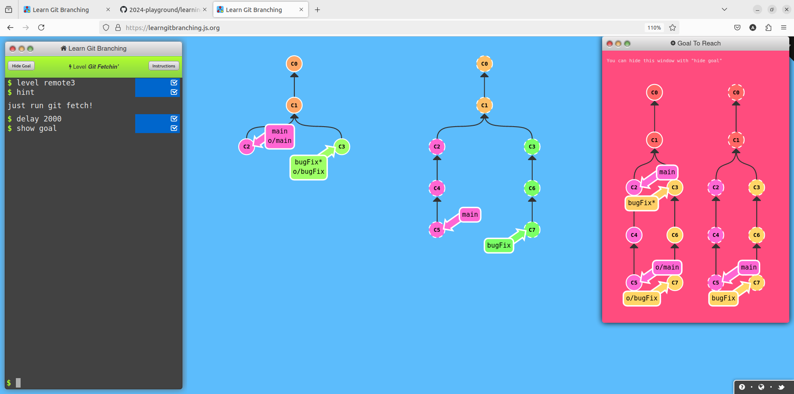
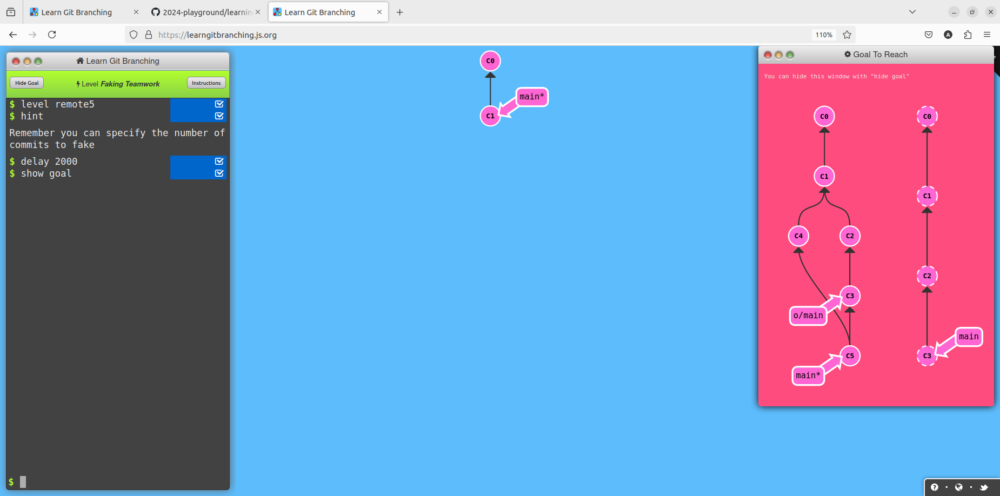

# Writeup of Git Remote Lab
## Push & Pull -- Git Remotes! 
### Level1 Clone Intro
**Goal-** Clone your existing repository 

**Solution**
```
git clone

```
### level2 Remote Branches
**Goal-** commit once in main then in remote branch 

**Solution**
```
git commit
git checkout o/main
git commit

```
### level3 git fetch
**Goal-** use fetch command to download all the commits from remote repository

**Solution**
```
git fetch

```
### Level4git pulling
**Goal-** Synchronize your local branch with remote branch with fetch and merge command

**Solution**
```
git fetch
git merge o/main

```

### Level5 Faking Teamwork
**Goal-** clone your remote repository,make changes on remote by faking teamwork and then fetch and merge

**Solution**
```
git clone
git fakeTeamwork main 2
git commit
git fetch
git merge o/main

```
### Level6 Git push
**Goal-** push two commits to the remote repository from the local repo

**Solution**
```
git commit
git commit
git push

```
### Level7 Diverged Work
**Goal-** Clone your repository,fake some teamwork,commit in local repository and then publish your work via rebasing

**Solution**
```
git clone 
git fakeTeamwork
git commit
git pull --rebase
git push

```
### Level8 Remote Rejected
**Goal-** Create another branch called feature and push that to the remote Also reset your main back to be in sync with the remote

**Solution**
```
git reset --hard o/main
git checkout -b feature c2
git push origin feature

```

## Advanced Git Remotes
### Level1 Push main
**Goal-** Push three feature branch to the remote repo in order

**Solution**
```
git fetch
git rebase o/main side1
git rebase side1 side2
git rebase side2 side3
git rebase side3 main
git push

```
### Level2 Merging with remotes
**Goal-** Complete level1 using merge command

**Solution**
```
git fetch
git checkout o/main
git merge side1
git merge side2
git merge side3
git branch -f main HEAD
git checkout main
git push

```
### Level3 Remote tracking
**Goal-** Push some work on to the main in remote branch without actually checking out on main locally 

**Solution**
```
git checkout -b side o/main
git commit
git fetch
git rebase o/main
git push

```
### Level4 Git Push arguments
**Goal-** Update both foo and main on the remote where git checkout command is disabled in this level

**Solution**
```
git push origin foo
git push origin main

```
### Level5 Git Push arguments expanded level
**Goal-** Pushing onto the remote branch with mentioning source and destination

**Solution**
```
git push origin foo:main
git push origin main^:foo

```
### Level6 Git Fetch Arguements
**Goal-** Fetch specified commits from the remote to local

**Solution**
```
git fetch origin c6:main
git fetch origin c3:foo
git checkout foo
git merge main

```


### Level7 Source of nothing
**Goal-** Delete one remote branch and create a new branch with git fetch

**Solution**
```
git push origin :foo
git fetch origin :bar

```
### Level8 Pull arguments
**Goal-** Fetch some commits from the remote ,make some new branches and merge those branches into other branches but it shouldn't take many branches

**Solution**
```
git pull origin c3:foo
git pull origin c2:side

```


