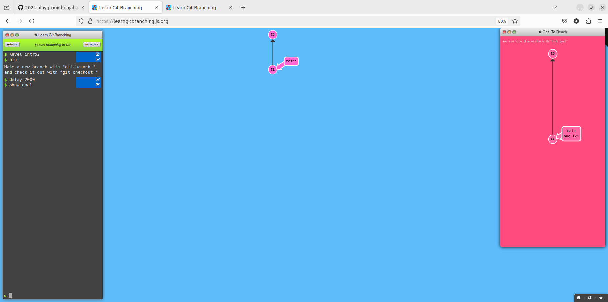
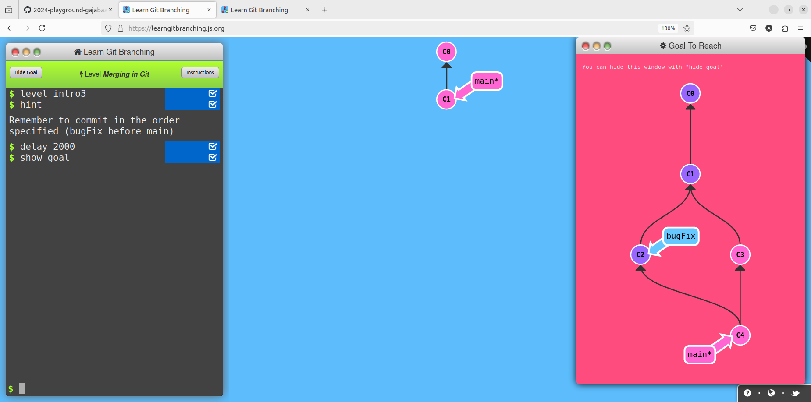
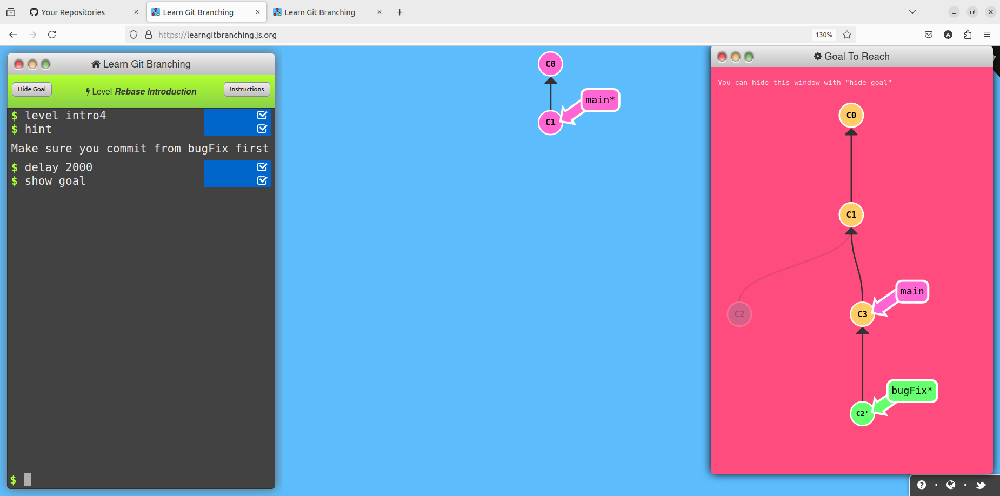

# Writeup of LearnGitBranching Lab
## Introduction Sequence
### Level1-Introduction to Git Commits
**Goal-** Commit twice 

**Solution**
```
git commit
git commit
```
### Level2-Branching in git
**Goal-** Make new branch named bugFix and switch it to that branch 


**Solution**
```
git checkout -b bugFix
```
### Level3-Merging in git
**Goal-** Make new branch named bugFix and switch it to that branch,commit once there then switch back to main,again commit once in main then with git merge command merge bugFix branch in to the main 


**Solution**
```
git checkout -b bugFix
git commit
git checkout main
git commit
git merge bugFix

```
### Level4-Rebase
**Goal-** Make new branch named bugFix and switch it to that branch,commit once there then switch back to main,again commit once in main.Again switch to bugFix and with git rebase command rebase main branch


**Solution**
```
git checkout -b bugFix
git commit
git checkout main
git commit
git checkout bugFix
git rebase main

```
# Ramping up
### Level1-Datach Head
**Goal-** Detach head from bugFix and attach it to commit instead


**Solution**
```
git checkout c4

```

