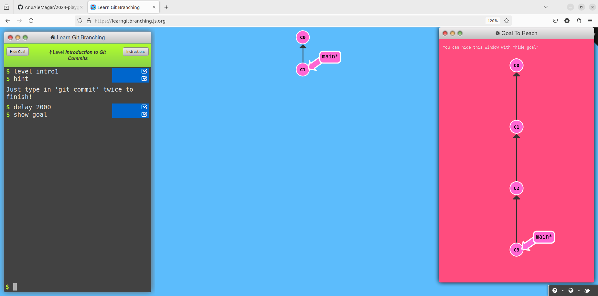

# Writeup of LearnGitBranching Lab
## Introduction Sequence
### Level1-Introduction to Git Commits
**Goal-** Commit twice 

**Solution**
```
git commit
git commit
```
### Level2-Branching in git
**Goal-** Make new branch named bugFix and switch it to that branch 


**Solution**
```
git checkout -b bugFix
```
### Level3-Merging in git
**Goal-** Make new branch named bugFix and switch it to that branch,commit once there then switch back to main,again commit once in main the with git merge command merge bugFix branch in to the main 


**Solution**
```
git checkout -b bugFix
git commit
git checkout main
git commit
git merge bugFix

```

