# Writeup of LearnGitBranching Lab
## Introduction Sequence
### Level1-Introduction to Git Commits
**Goal-** Commit twice 

**Solution**
```
git commit
git commit
```
### Level2-Branching in git
**Goal-** Make new branch named bugFix and switch it to that branch 


**Solution**
```
git checkout -b bugFix
```
### Level3-Merging in git
**Goal-** Make new branch named bugFix and switch it to that branch,commit once there then switch back to main,again commit once in main then with git merge command merge bugFix branch in to the main 


**Solution**
```
git checkout -b bugFix
git commit
git checkout main
git commit
git merge bugFix

```
### Level4-Rebase
**Goal-** Make new branch named bugFix and switch it to that branch,commit once there then switch back to main,again commit once in main.Again switch to bugFix and with git rebase command rebase main branch


**Solution**
```
git checkout -b bugFix
git commit
git checkout main
git commit
git checkout bugFix
git rebase main

```
## Ramping up
### Level1-Datach Head
**Goal-** Detach head from bugFix and attach it to commit instead


**Solution**
```
git checkout c4

```
### Level2-Detaching Head using Relative Ref(^)
**Goal-** Checkout to parent commit of bugFix using relative refs


**Solution**
```
git checkout bugFix^

```
### Level3-Detaching Head using Relative Re
f(~)
**Goal-** Move HEAD ,main, bugFix to destination position as shown in the images below


**Solution**
```
git branch -f bugFix HEAD~2
git branch -f main c6
git checkout HEAD^

```
### Level4-Reversing changes in git
**Goal-** Reverse the most recent commit in both local branch and pushed branch ,pushed is remote branch 


**Solution**
```
git reset HEAD^
git checkout pushed
git revert HEAD
```
##Moving Work Around
### Level1- Cherry-pick intro
**Goal-** Simply copy some work from three branches as shown in images below


**Solution**
```
git cherry-pick c3 c4 c7

```


### Level2- Interactive Rebase
**Goal-** do an interactive rebase and achieve following order
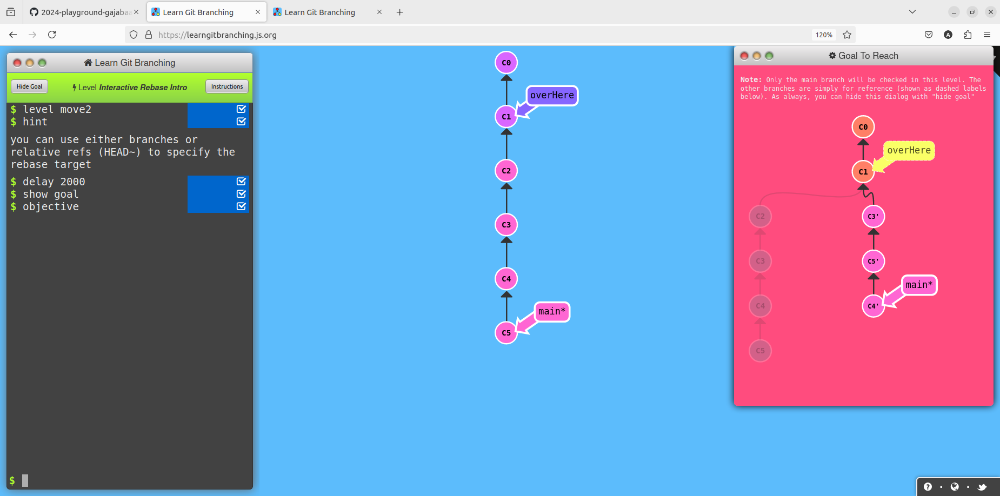

**Solution**
```
git rebase -i HEAD_4

```
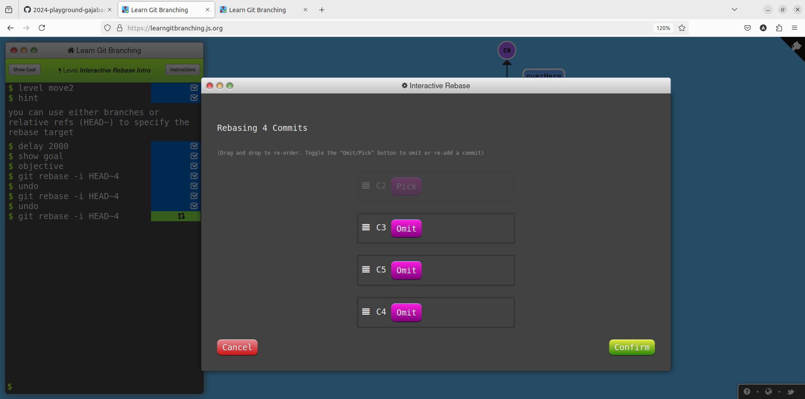

## A mixed bag
### Level1 Grabbing just one Commit
**Goal-** Main receives the commit that bugfix references
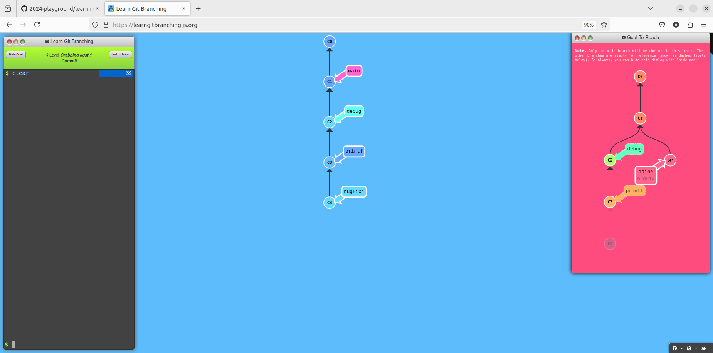

**Solution**
```
git rebase -i main
git branch -f main HEAD

```
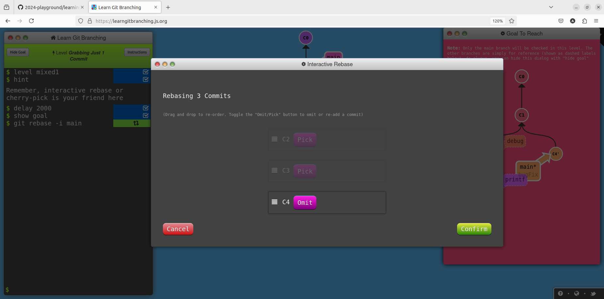

### Level2 Juggling commits
**Goal-** Main receives the commit that bugfix references
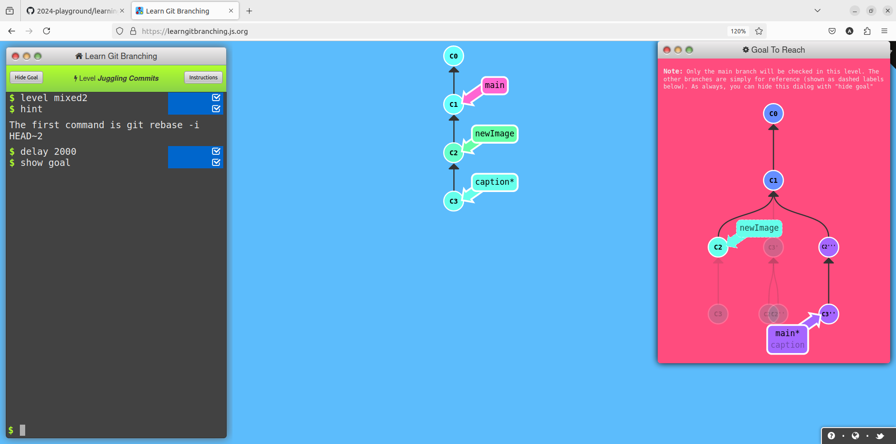

**Solution**
```
git rebase -i HEAD~2
```
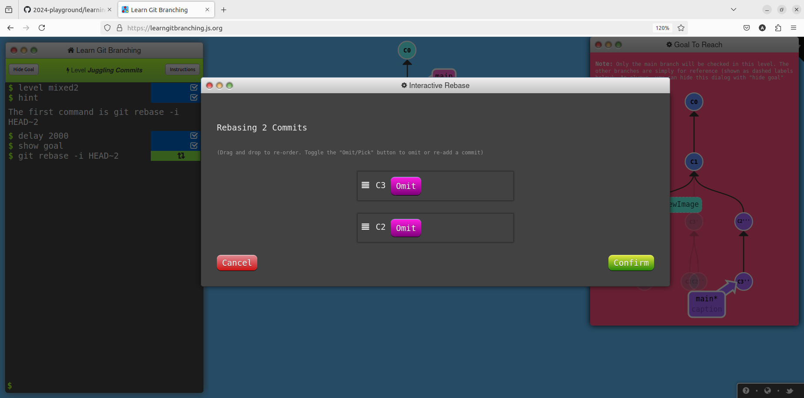
```
git commit --amend
git rebase -i HEAD~2
git branch -f main HEAD
```


### Level3 Juggling commits #2
**Goal-** This time using cherry-pick 
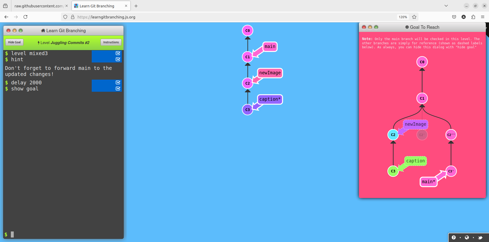

**Solution**
```
git checkout main
git cherry-pick c2
git branch -f main c1
git cherry-pick c2' c3

```
### Level4 git tag
**Goal-** Create  the tags as shown in goal and then checkout v1


**Solution**
```
git tag v0 HEAD~2
git tag v1 c2
git checkout v1

```


### Level5 git tag describe
**Goal-** Make changes as shown in the goal

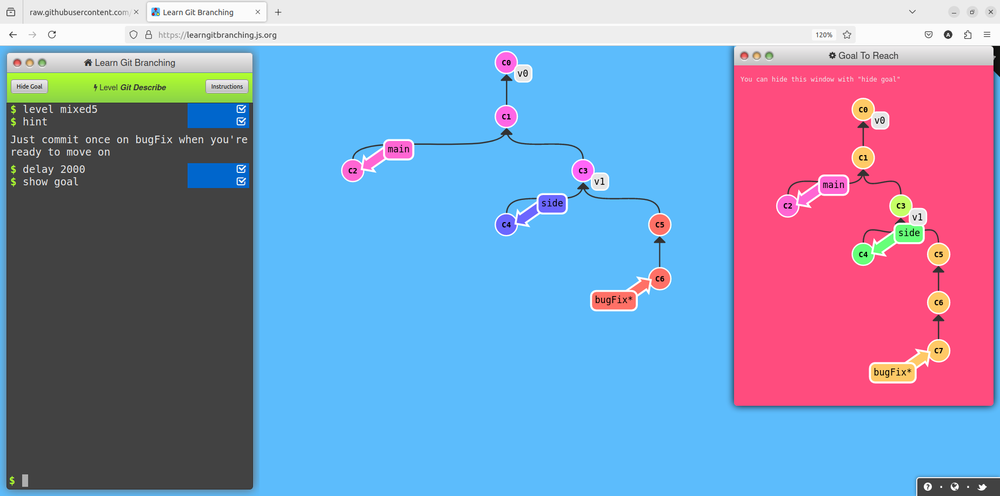

**Solution**
```
git commit

```
## Advanced Topic
### level1
**Goal-** Rebasing multiple branch
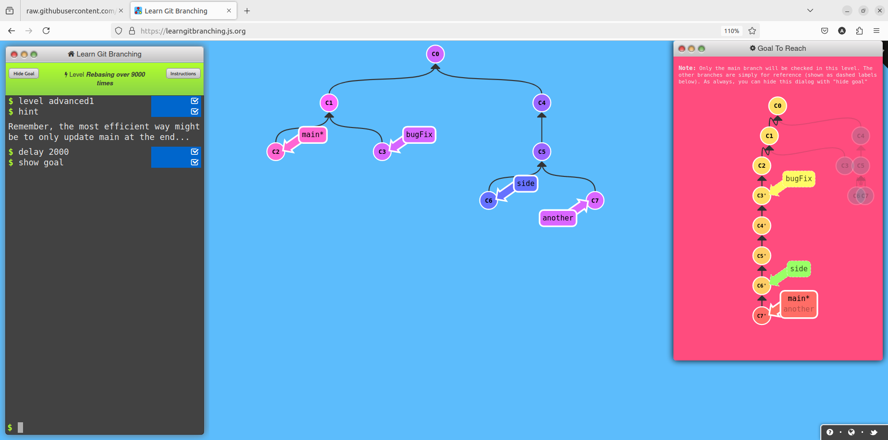

**Solution**
```
git rebase main bugFix
git rebase  bugFix side
git rebase side another
git branch -f main HEAD

```
### level2
**Goal-** Use modifiers^
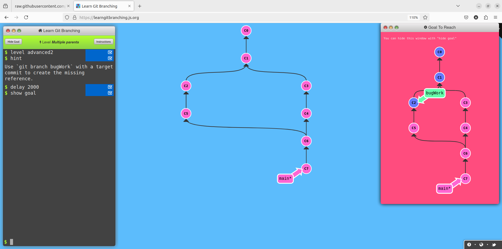

**Solution**
```
git branch f bugWork HEAD~^2~
```

### level3
**Goal-** Use modifiers^
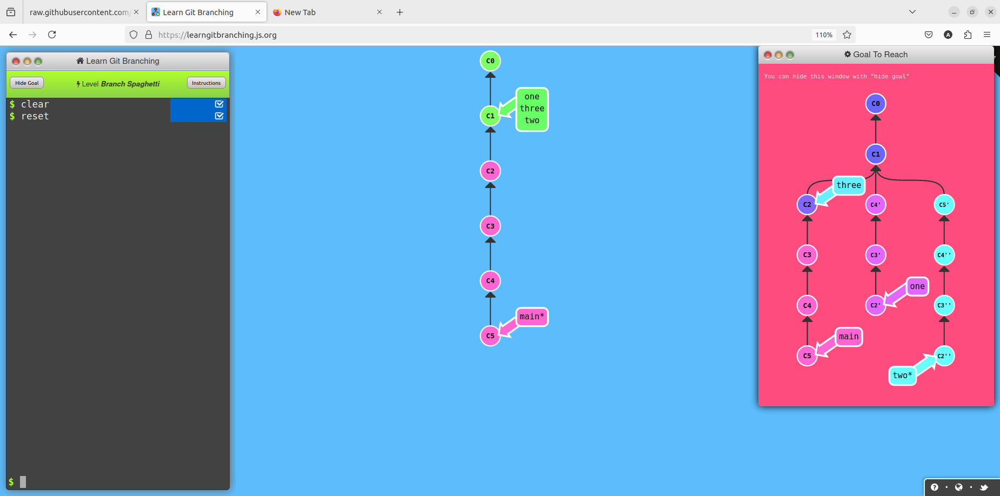

**Solution**
```
git branch -f three c2
git checkout one
git cherry-pick c4 c3 c2
git checkout two
git cherry-pick c5 c4' c3' c2'

```

