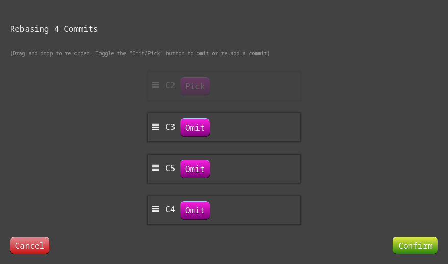
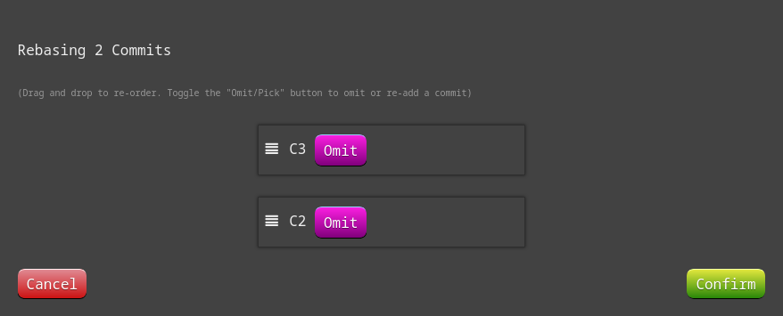
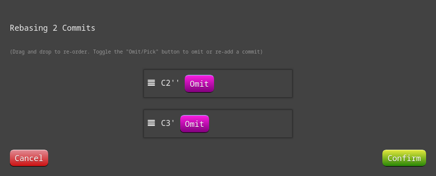
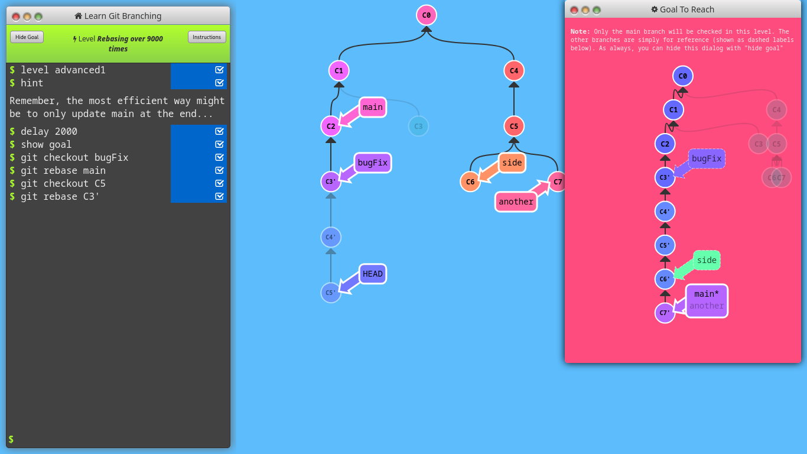
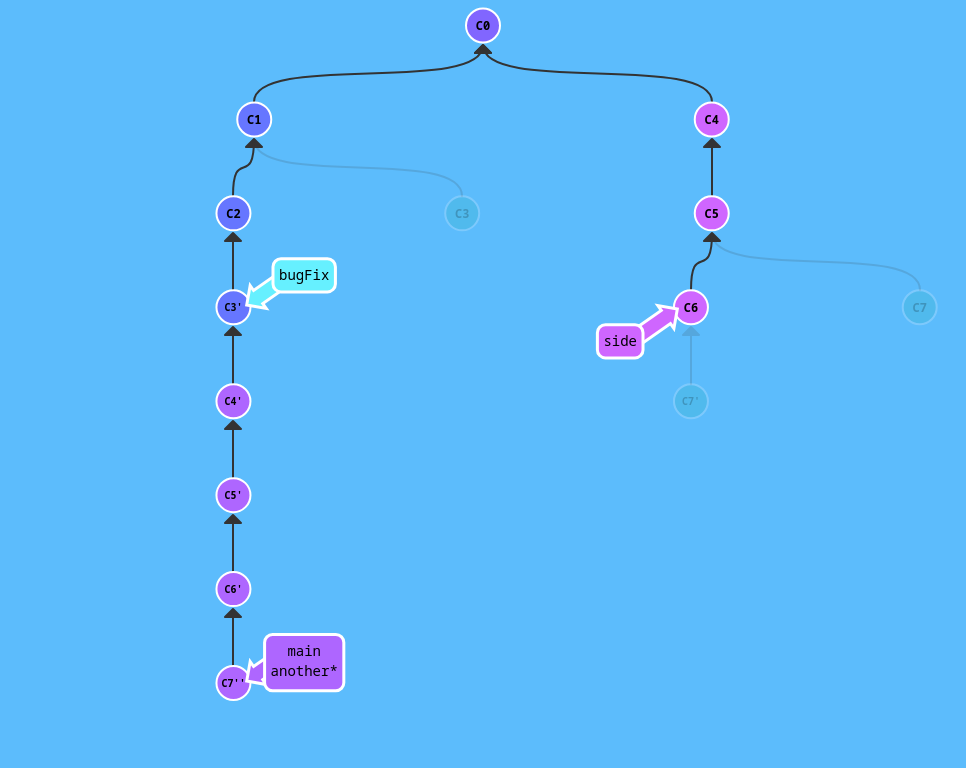
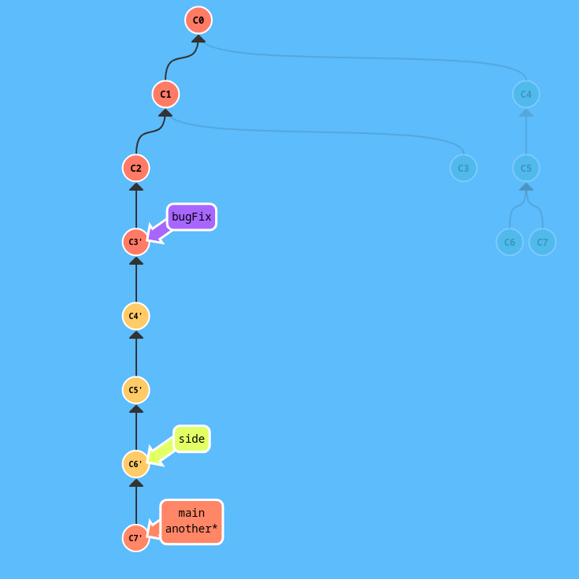

#  Introduction Sequence 

A nicely paced introduction to the majority of git commands 

## 1: Introduction to Git Commits


```sh
git commit
git commit
```

## 2: Branching in Git


```sh
git branch bugFix
git checkout bugFix
```

## 3: Merging in Git


```sh
git branch bugFix
git checkout bugFix
git commit
git checkout main
git commit
git merge bugFix
```

## 4: Rebase Introduction


```sh
git branch bugFix
git checkout bugFix
git commit
git checkout main
git commit
git checkout bugFix
git rebase main
```

# Ramping Up 

The next serving of 100% git awesomes-ness. Hope you're hungry 

## 1: Detach yo' HEAD


```sh
git checkout C4
```

## 2: Relative Refs (^)


```sh
git checkout C3
```
OR,
```sh
git checkout C4^
```
OR,
```sh
git checkout C4
git checkout HEAD^
```

## 3: Relative Refs #2 (~)


```sh
git branch -f bugFix bugFix~3
git branch -f main C6
git checkout HEAD~1
```

## 4: Reversing Changes in Git


```sh
git reset C1
git checkout C2
git revert HEAD
git branch -f pushed C2'
```
OR,
```sh
git reset HEAD^
git checkout pushed
git revert HEAD
```

# Moving Work Around 

"Git" comfortable with modifying the source tree :P 

## 1: Cherry-pick Intro


```sh
git cherry-pick C3 C4 C7
```

## 2: Interactive Rebase Intro


```sh
git rebase -i C1
```


# A Mixed Bag 

A mixed bag of Git techniques, tricks, and tips 

## 1: Grabbing Just 1 Commit


```sh
git reset HEAD^
git checkout main
git cherry-pick C4
```

## 2: Juggling Commits


```sh
git rebase -i C1
```

```sh
git commit --amend
```
```sh
git rebase -i C1
```

```sh
git branch -f main C3''
```

## 3: Juggling Commits #2


```sh
git checkout main
git cherry-pick C2
git reset HEAD^
git cherry-pick C2' C3
```

## 4: Git Tags


```sh
git tag v0 C1
git tag v1 C2
git checkout v1
```

## 5: Git Describe


```sh
git describe C1
git commit
```

# Advanced Topics 

For the truly brave! 

## 1: Rebasing over 9000 times


- Pathetic Attempt -1:



- Ugh. I give up!
```sh
show solution
```


- Oh... Ok I will try again.

- Unsatisfactory sucess: Site said I had solved it, but my solution wasn't quite resembling the goal. Just look at the side branch.
```sh
git rebase main bugFix
git rebase side another
git rebase bugFix another
git branch -f main another
```


- Satisfactory sucess:
```sh
* git rebase main bugFix
* git rebase bugFix side
* git rebase side another
|\
| \
|  * (HEAD -> screenshot_image) git branch -f main another
|  * git checkout main
|
* (origin/main) git rebase another main
```


## 2: Multiple parents


```sh
git checkout HEAD^
git checkout HEAD^2
git checkout HEAD^
```
OR,
```sh
git checkout HEAD~^2~
```
THEN,
```sh
git branch bugWork
git checkout main
```

## 3: Branch Spaghetti


- My solution:
```sh
git rebase C2 three
git checkout one
git cherry-pick c4 c3 c2  
git rebase -i two C5: C5 > C4 > C3 > C2
git rebase C2'' two
```

- Their Solution
```sh
git checkout one
git cherry-pick C4 C3 C2
git checkout two
git cherry-pick C5 C4 C3 C2
git branch -f three C2
```