#  Introduction Sequence 

A nicely paced introduction to the majority of git commands 

## 1: Introduction to Git Commits

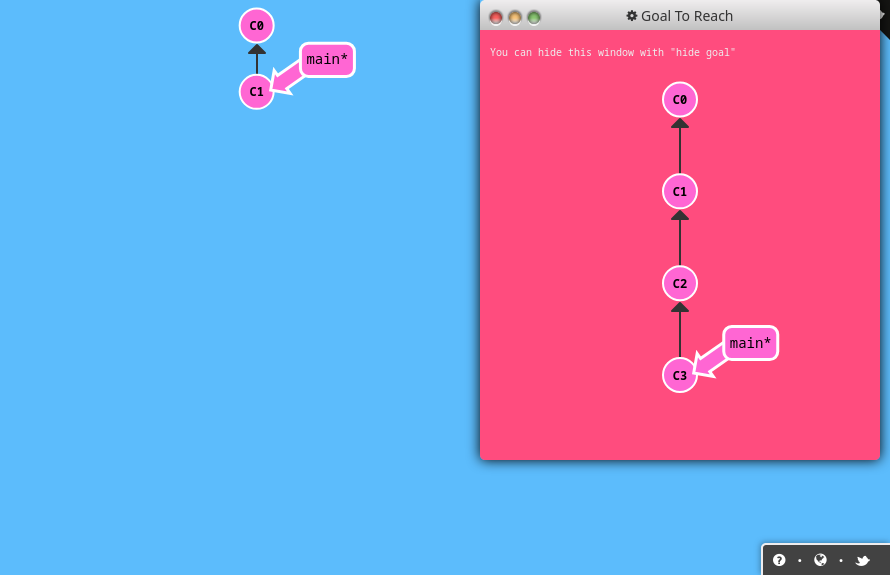

```sh
git commit
git commit
```

## 2: Branching in Git

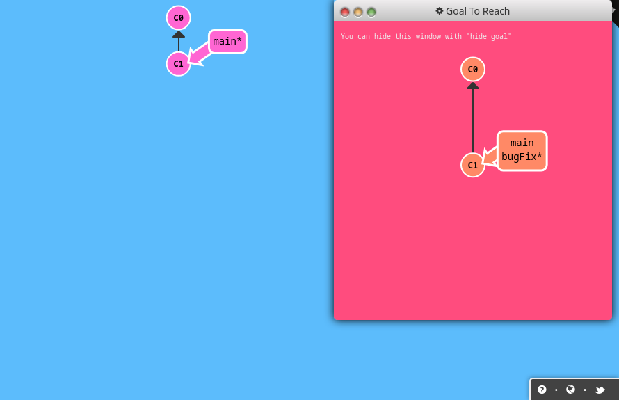

```sh
git branch bugFix
git checkout bugFix
```

## 3: Merging in Git

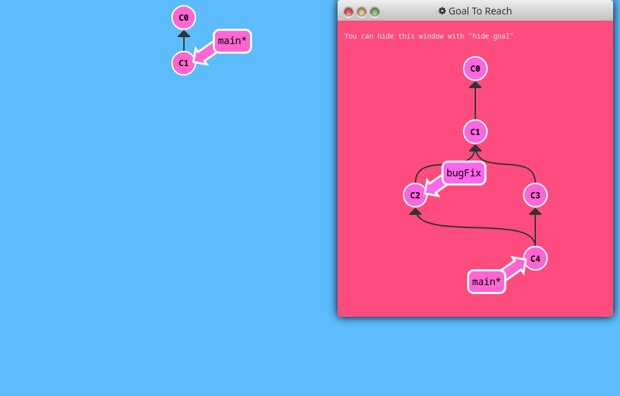

```sh
git branch bugFix
git checkout bugFix
git commit
git checkout main
git commit
git merge bugFix
```

## 4: Rebase Introduction

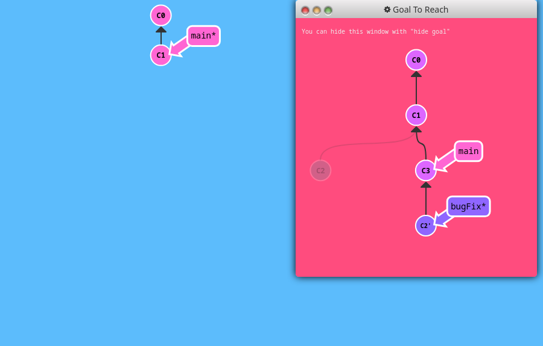

```sh
git branch bugFix
git checkout bugFix
git commit
git checkout main
git commit
git checkout bugFix
git rebase main
```

# Ramping Up 

The next serving of 100% git awesomes-ness. Hope you're hungry 

## 1: Detach yo' HEAD

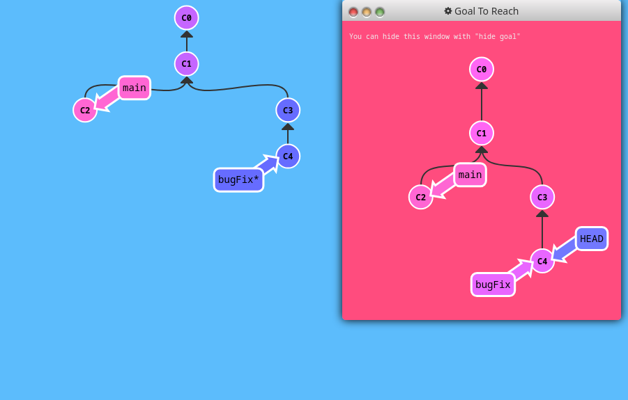

```sh
git checkout C4
```

## 2: Relative Refs (^)

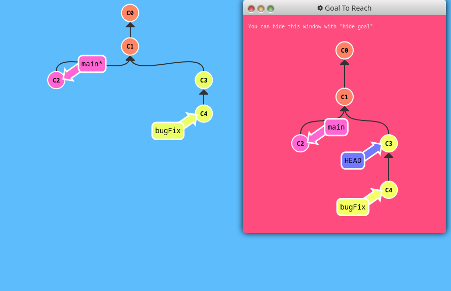

```sh
git checkout C3
```
OR,
```sh
git checkout C4^
```
OR,
```sh
git checkout C4
git checkout HEAD^
```

## 3: Relative Refs #2 (~)

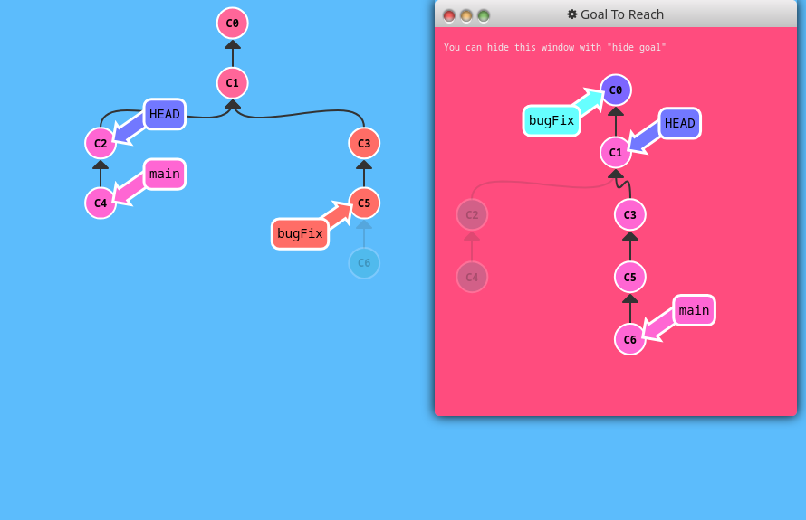

```sh
git branch -f bugFix bugFix~3
git branch -f main C6
git checkout HEAD~1
```

## 4: Reversing Changes in Git

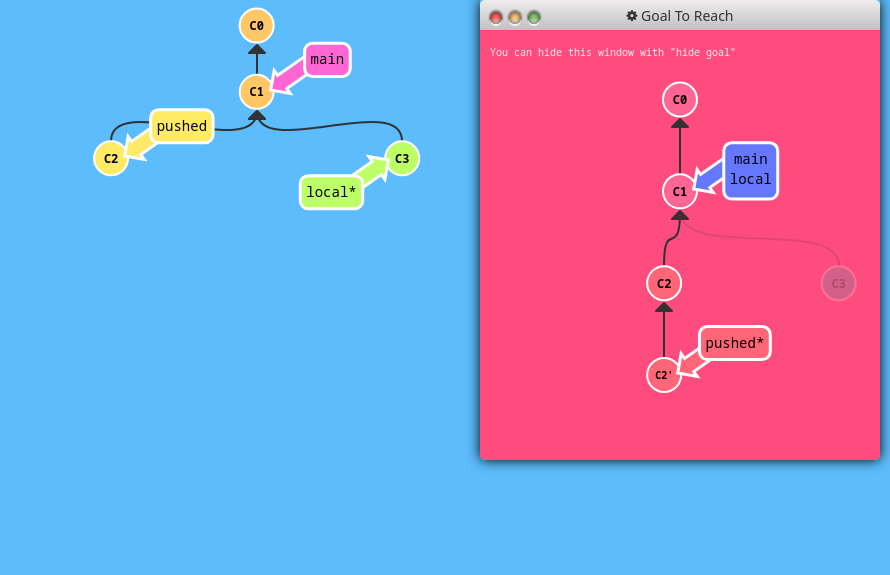

```sh
git reset C1
git checkout C2
git revert HEAD
git branch -f pushed C2'
```
OR,
```sh
git reset HEAD^
git checkout pushed
git revert HEAD
```

# Moving Work Around 

"Git" comfortable with modifying the source tree :P 

## 1: Cherry-pick Intro

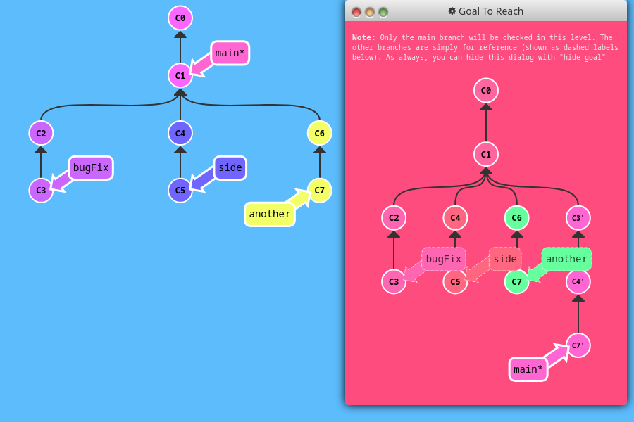

```sh

```

## 2: Interactive Rebase Intro

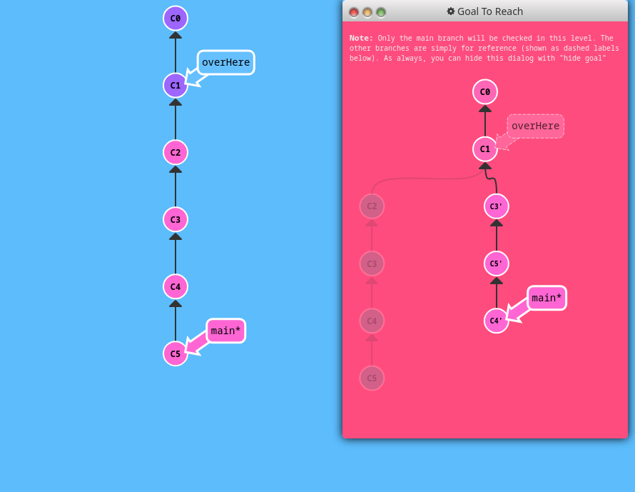

```sh

```

# A Mixed Bag 

A mixed bag of Git techniques, tricks, and tips 

## 1: Grabbing Just 1 Commit

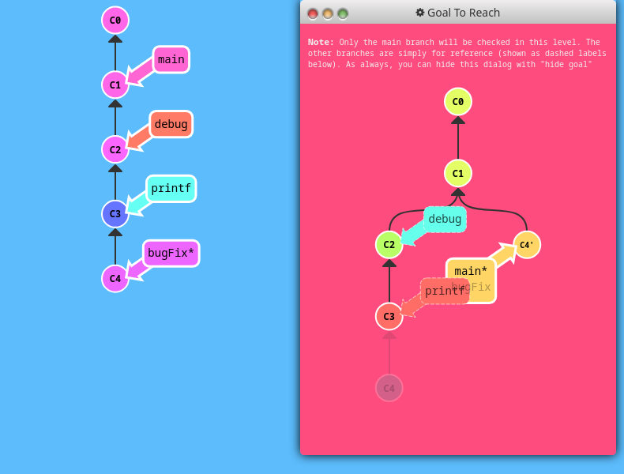

```sh

```

## 2: Juggling Commits

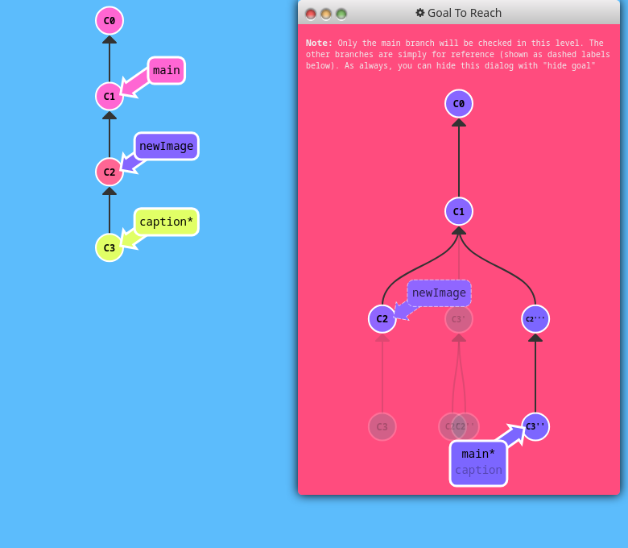

```sh

```

## 3: Juggling Commits #2


```sh

```

## 4: Git Tags

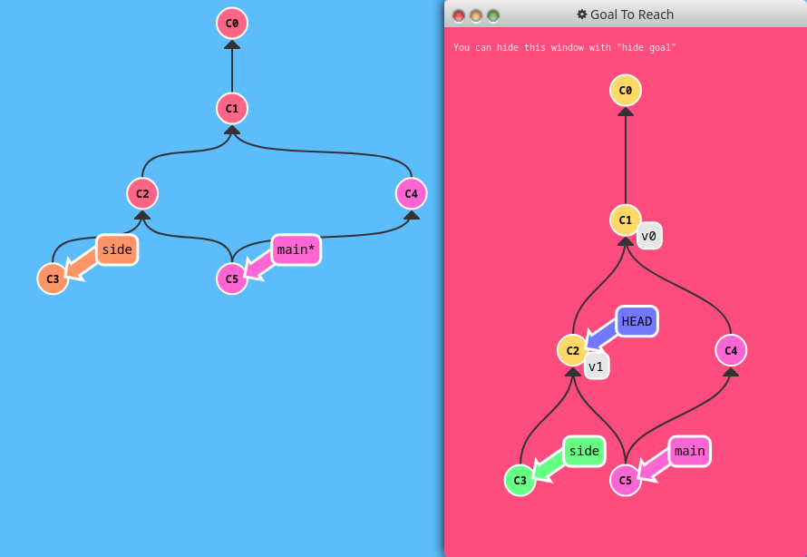

```sh

```

## 5: Git Describe

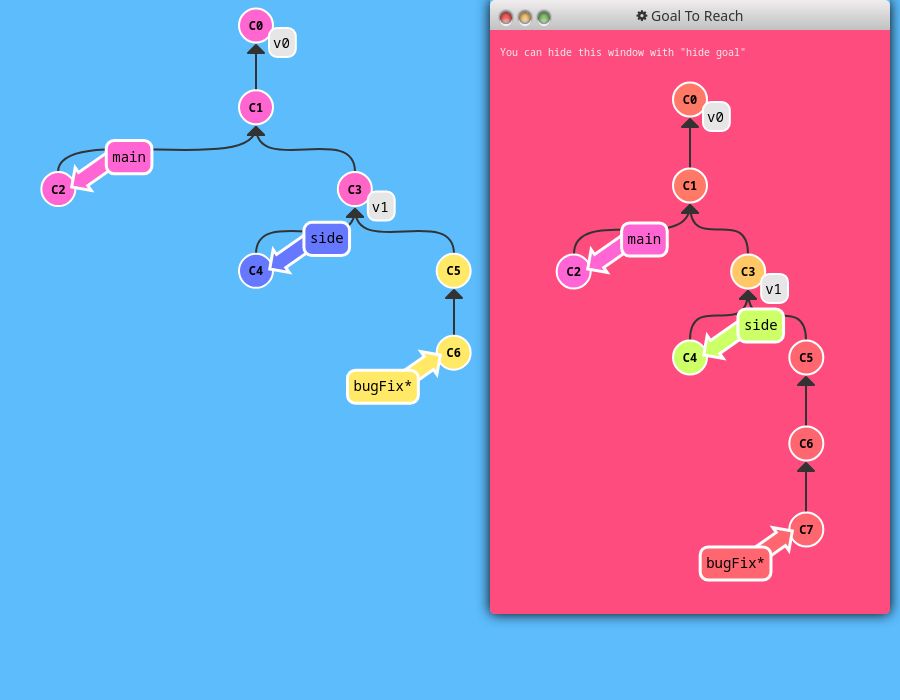

```sh

```

# Advanced Topics 

For the truly brave! 

## 1: Rebasing over 9000 times

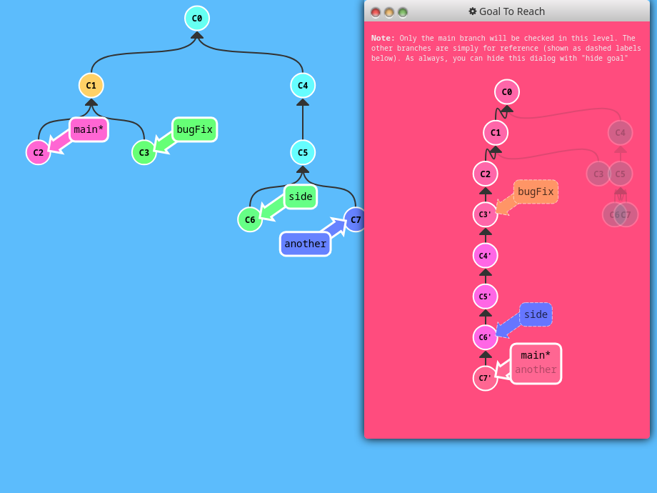

```sh

```

## 2: Multiple parents

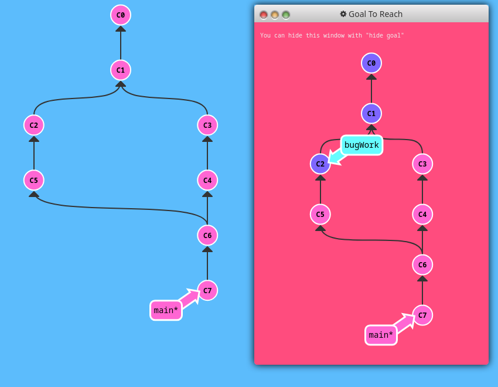

```sh

```

## 3: Branch Spaghetti

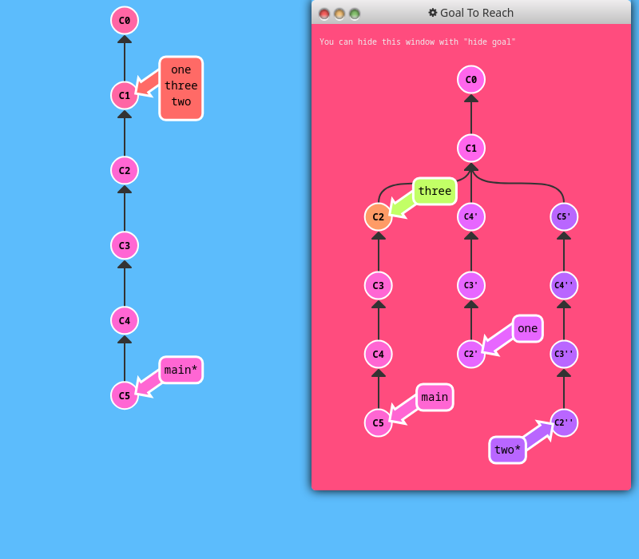

```sh

```