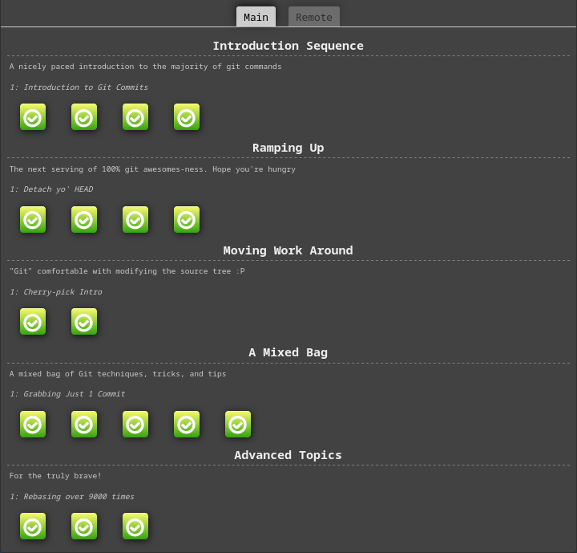
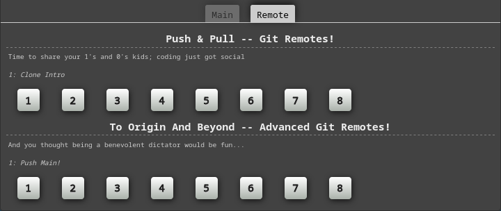

Writeups for [learngitbranching](https://learngitbranching.js.org/), as a part of Security Fundamentals Summer Class's GIT session by Respected [Prasant Adhikari](https://www.linkedin.com/in/prasantadh/) sir @ [ICP](https://icp.edu.np/).

At the time of writing, there are two categories: 

- Main

- Remote

The write-up for Main can be found at [Main.md](./Main.md), and the write-up for Remote can be found at [Remote.md](./Remote.md).