# Push & Pull -- Git Remotes! 

Time to share your 1's and 0's kids; coding just got social 

## 1: Clone Intro

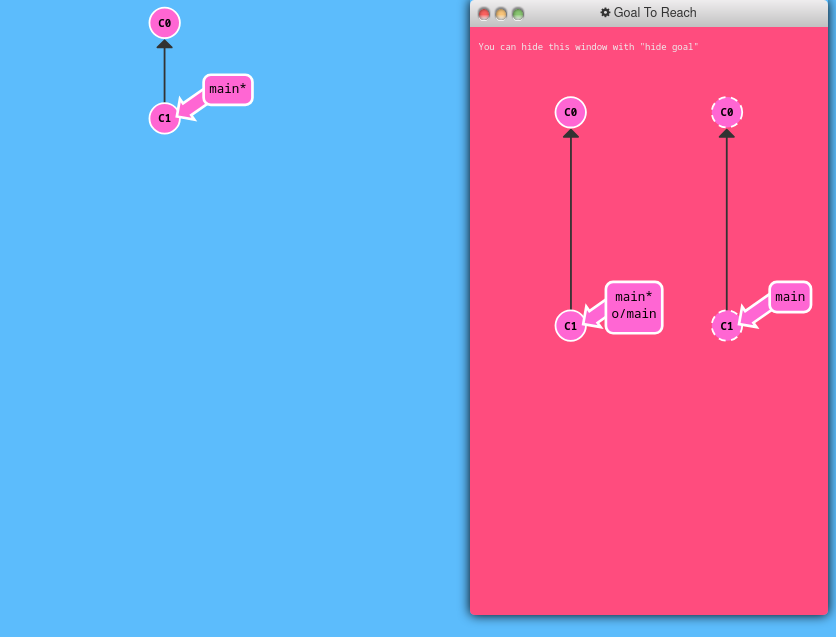

```sh
git clone
```

## 2: Remote Branches

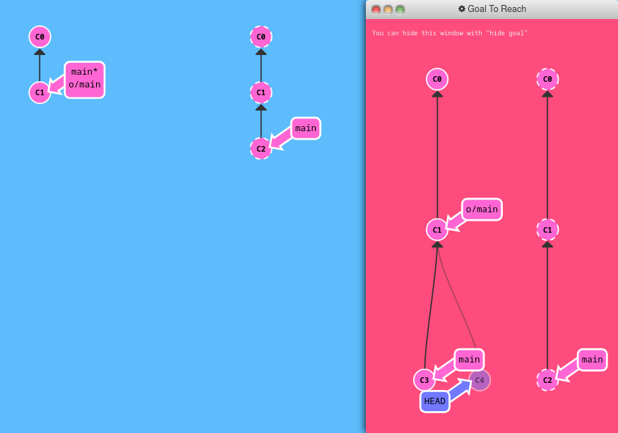

```sh
git commit
git checkout o/main
git commit
```

## 3: Git Fetchin'

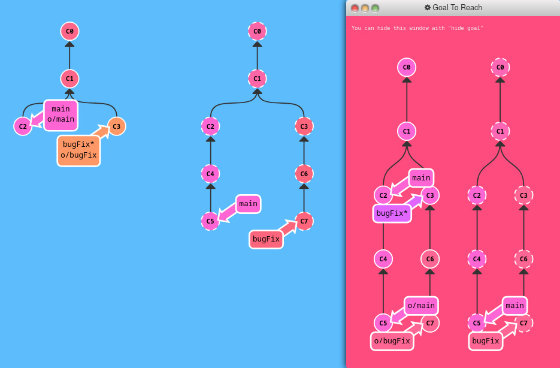

```sh
git fetch
```

## 4: Git Pullin'

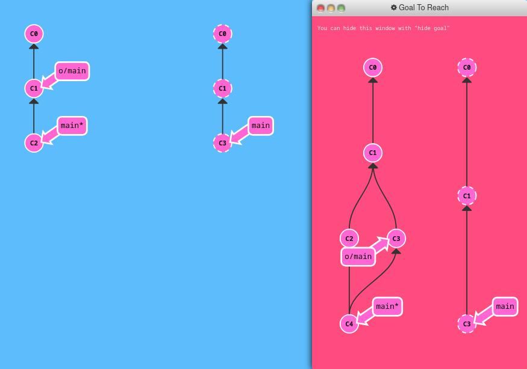

```sh
git pull
```

## 5: Faking Teamwork

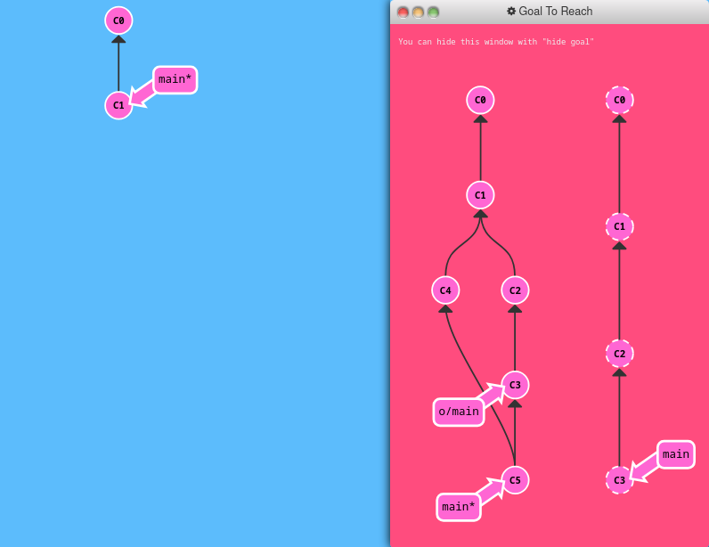

```sh
git clone
git fakeTeamwork main 2
git fetch
git commit
git merge o/main
```

## 6: Git Pushin'

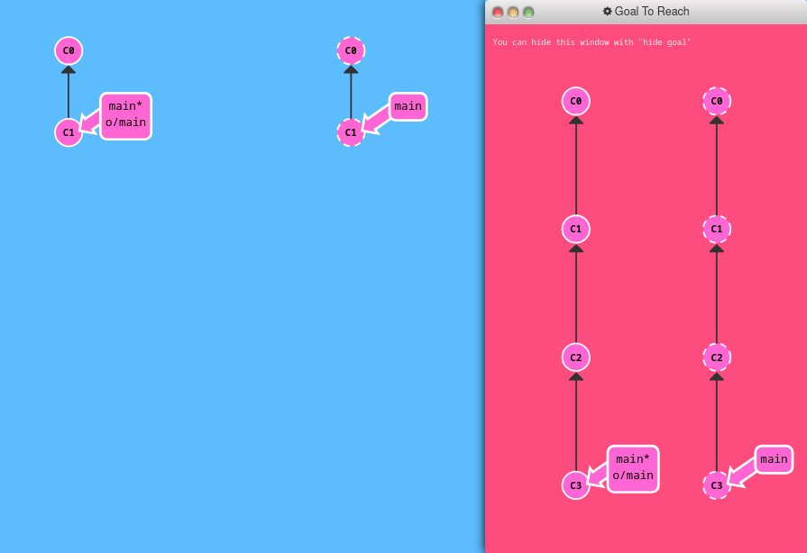

```sh
git commit
git commit
git push
```

## 7: Diverged History

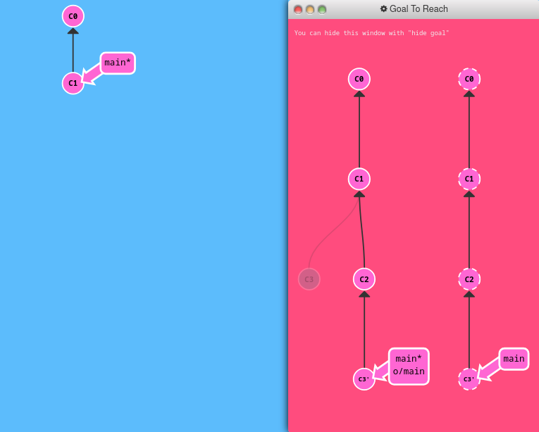

```sh
git clone
git fakeTeamwork
git commit
git pull --rebase
git push
```

## 8: Locked Main

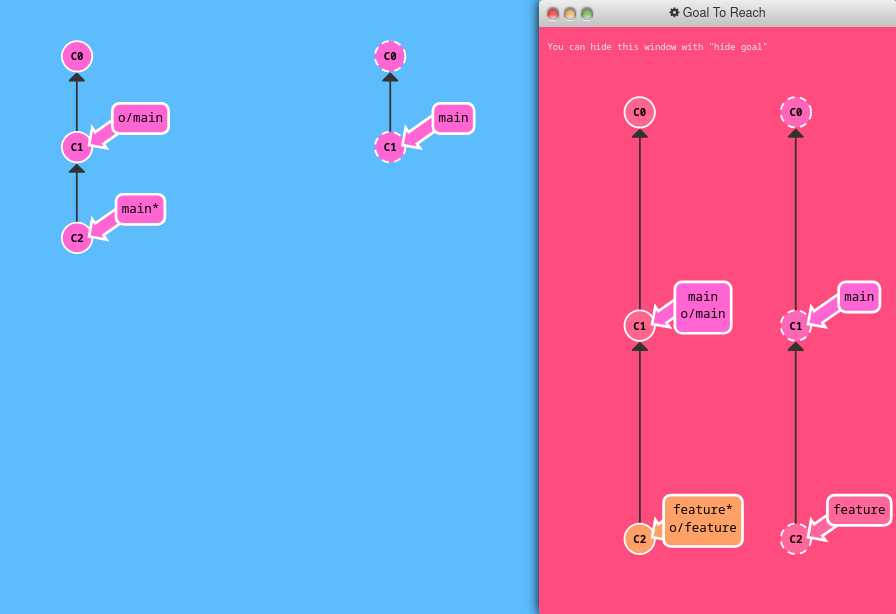

```sh
git branch feature
git reset HEAD^
git checkout feature
git push
```

# To Origin And Beyond -- Advanced Git Remotes! 

And you thought being a benevolent dictator would be fun... 

## 1: Push Main!

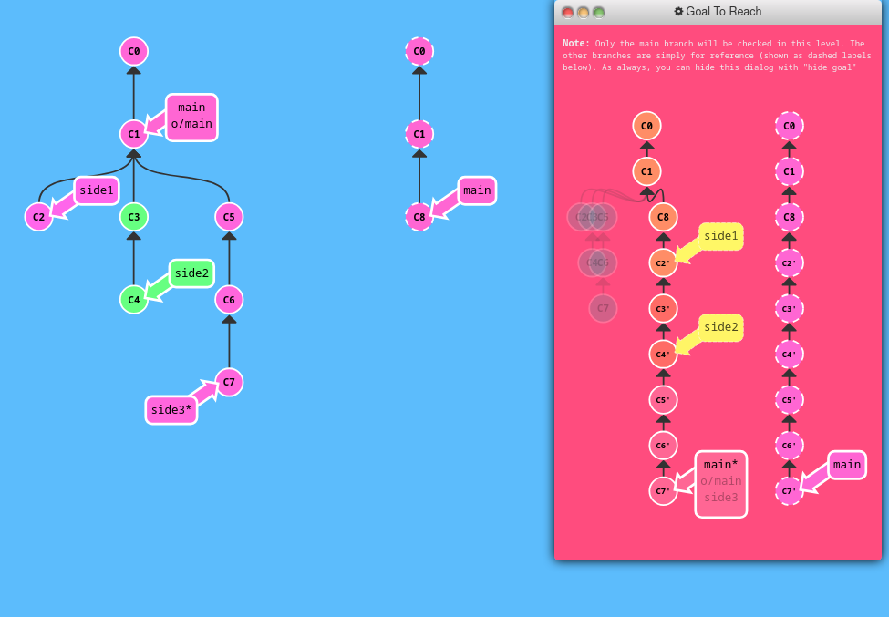

```sh
git fetch 
git rebase o/main side1
git rebase side1 side2
git rebase side2 side3
git rebase side3 main
git push
```

## 2: Merging with remotes

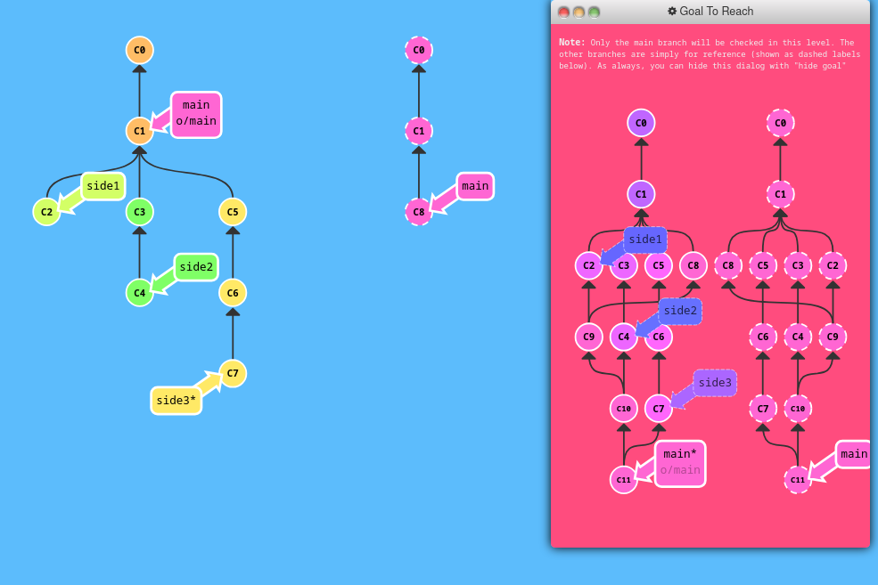

```sh
git fetch
git checkout side1
git merge o/main
git merge side2
git merge side3
git rebase side1 main
git push
```
OR,
```sh
git checkout main
git pull
git merge side1
git merge side2
git merge side3
git push
```

## 3: Remote Tracking

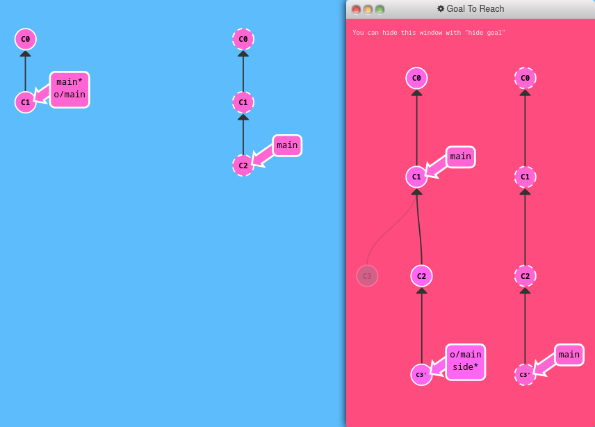

```sh
git checkout -b side o/main
git commit
git pull --rebase
git push
```

## 4: Git push arguments

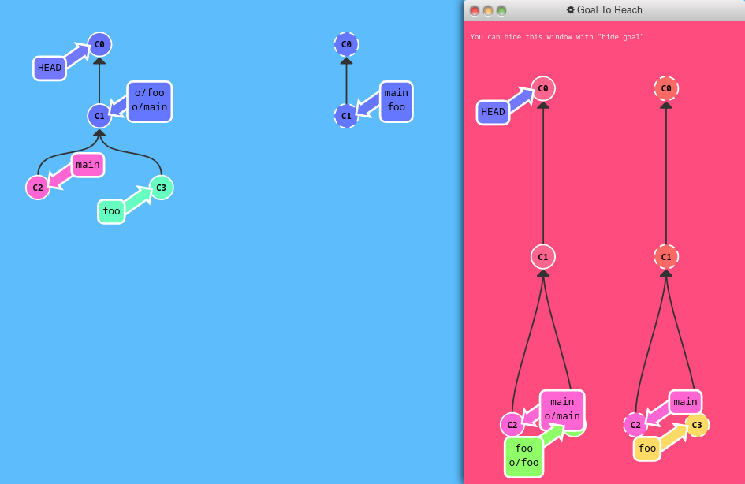

```sh
git push origin main
git push origin foo
```

## 5: Git push arguments -- Expanded!

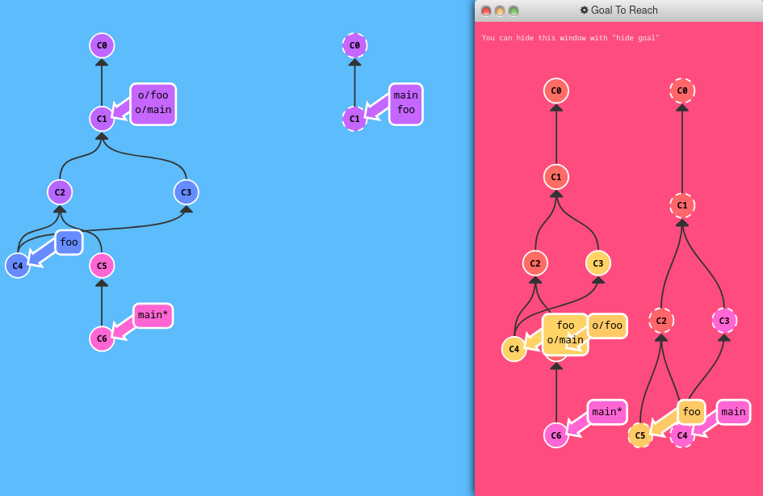

```sh
git checkout foo
git push origin foo:main
git push origin main^:foo
git checkout main
```
OR,
```sh
git push origin main^:foo
git push origin foo:main
```

## 6: Fetch arguments

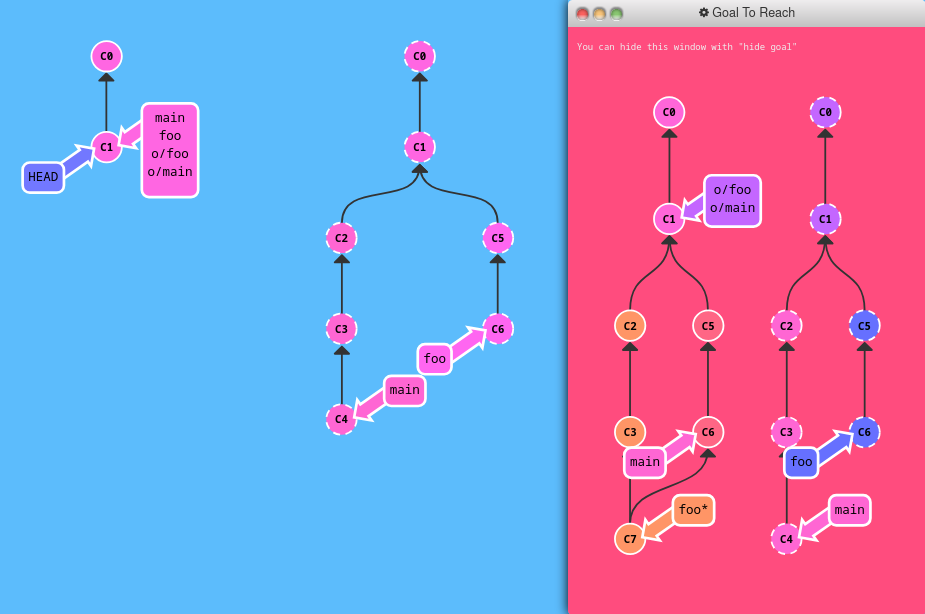

```sh
git fetch origin C6:main
git fetch origin C3:foo
git checkout foo
git merge main
```

## 7: Source of nothing

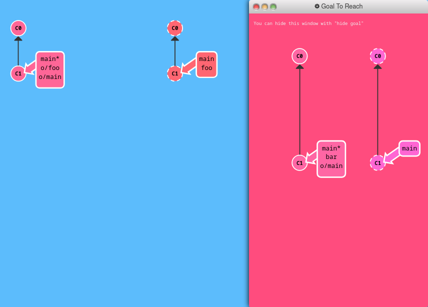

```sh
git push origin :foo
git fetch origin :bar
```

## 8: Pull arguments

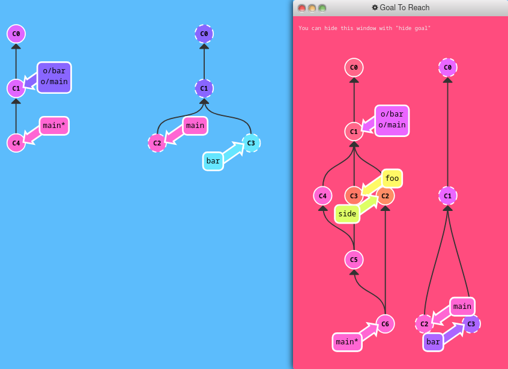

- My solution:
```sh
git fetch origin C2:side
git pull origin C3:foo
git merge side
```

- Their Solution:
```sh
git pull origin c3:foo
git pull origin c2:side
```
