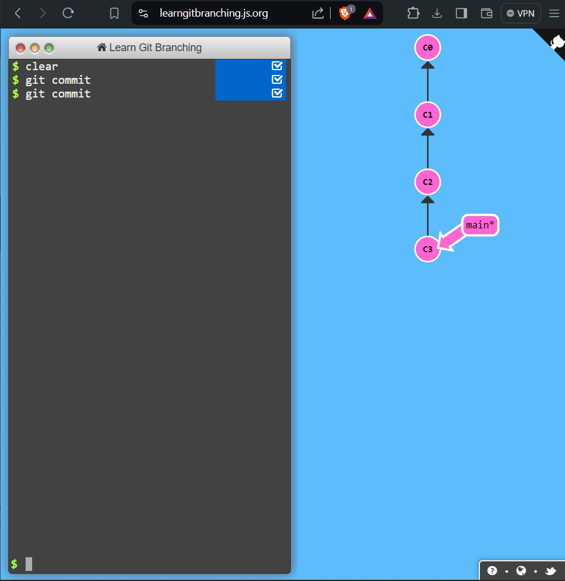
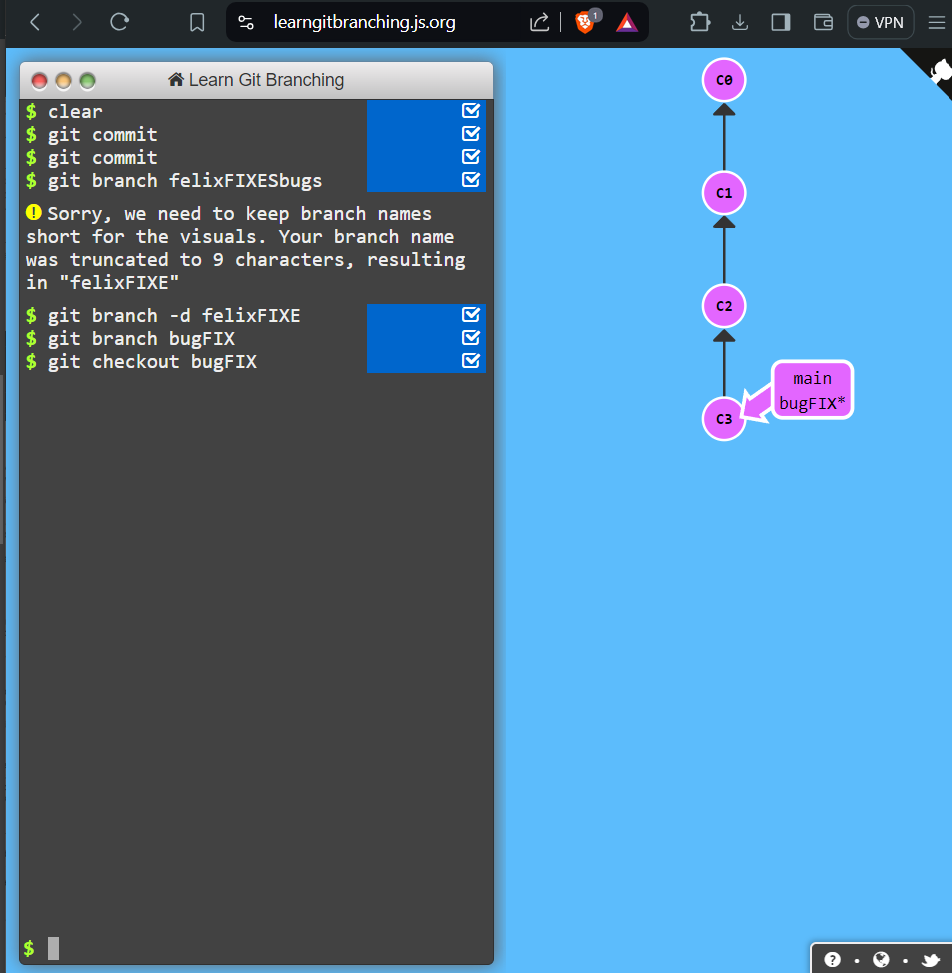
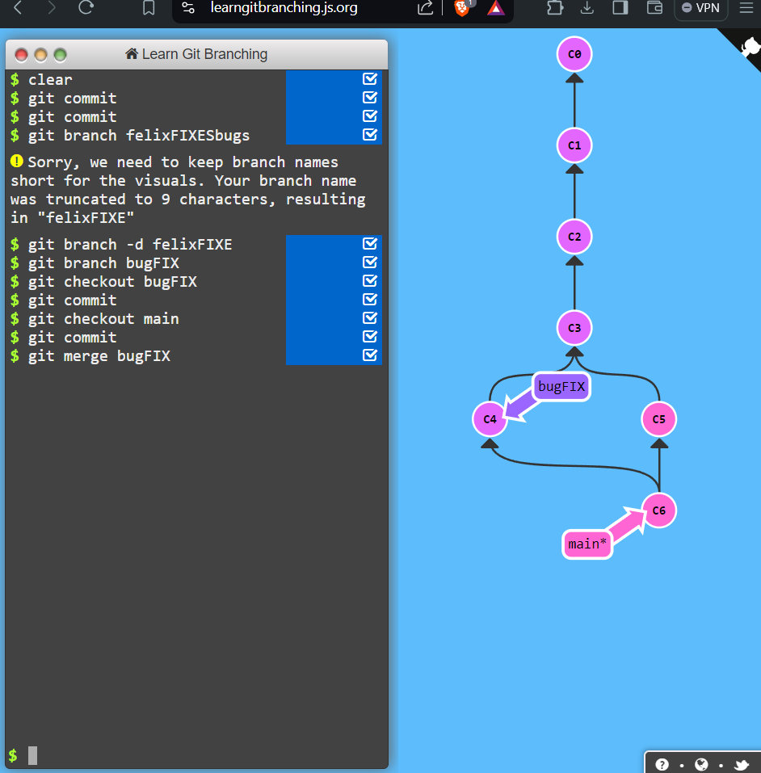
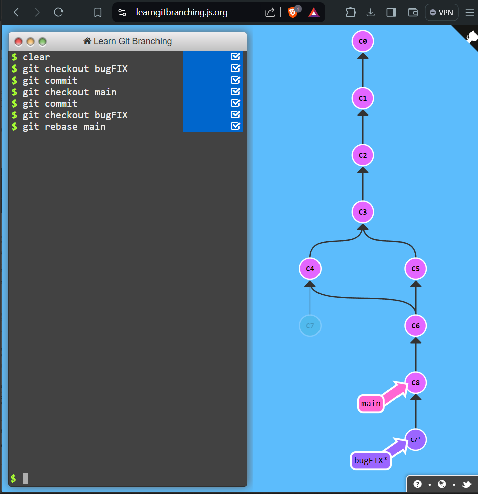

# Git Commits, Branches, and Merging

In this writeup, we will explore the fundamental concepts of Git commits, branching, and merging. These are essential skills for effectively managing your code in a version control system like Git.

## Introduction to Git Commits

A commit in a Git repository records a snapshot of all the (tracked) files in your directory. Git maintains a history of all commits, allowing you to track changes, revert to previous states, and collaborate with others.



**Solution:**
To create a commit, use the following command:

```sh
git commit
```

## Branching in Git

Branches in Git are pointers to a specific commit. They are used to logically divide your work, allowing you to experiment and develop features independently.

Branches essentially say, "I want to include the work of this commit and all parent commits."



**Commands:**

- Create a new branch: `git branch branchName`
- Switch to a branch: `git checkout branchName`
- Shortcut to create and switch to a new branch: `git checkout -b branchName`
  (branchName is bugFIX in the above image example)

(Note: I intially wanted to name my branch as felixFIXESbugs but a branch name cannot have more than 9 characters, so changed again to bugFIX)

## Branches and Merging

Merging is the process of including all the work from both "parent" branches. This allows you to combine the changes made in different branches.



**Commands:**

- Create a new branch `bugFIX`: `git checkout -b bugFIX`
- Commit changes on the `bugFIX` branch: `git commit`
- Switch to the `main` branch: `git checkout main`
- Commit changes on the `main` branch: `git commit`
- Merge the `bugFIX` branch into `main`: `git merge bugFIX`

## Git Rebase

Rebase is another way of combining work between branches. It takes a set of commits, "copies" them, and places them somewhere else. This helps to maintain a clean, linear sequence of commits.



**Commands:**

- Create a new branch `bugFIX`: `git checkout -b bugFIX`
- Commit changes on the `bugFIX` branch: `git commit`
- Switch to the `main` branch: `git checkout main`
- Commit changes on the `main` branch: `git commit`
- Rebase the `bugFIX` branch onto the `main` branch: `git checkout bugFIX` and `git rebase main`

By practicing these concepts using the [Learn Git Branching](https://learngitbranching.js.org/) website, you can develop a deeper understanding of how Git manages your code and collaborates with others.
