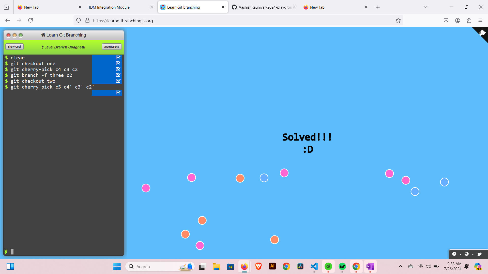
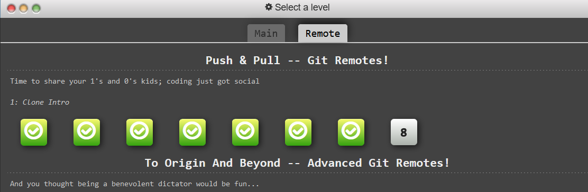

Learning Git command from the site 
learninggitbranching.org

The first task was to learn the command git commit
commit basically creates the checkout of current work

command - git commit -m "your message"

------------------------------------------------------------------------------------

Level Introduction to Git Commit

command - git commit

git commit create a snapshot of the staged changes along a timeline of a Git projects history.

---------------------------------------------------------------------------------

Level Learn Git Branching

Braches in Git are  are simply pointers to a specific commit --

Branch Early, and Branch Often

git branch bugFix
git checkout bugFix (inorder to change branch checkout command is used)

also
git checkout -b [branch name] (creates a new branch and change to that branch)

-------------------------------------------------------------------------------------

Level Merging in Git

We can merge two branches using git merge command, we have to make sure that the commits are updated.

git branch bugFix
git checkout bugFix
git commit
git checkout main
git commit
git merge bugFix   (merge bugFix to main as we were on main branch)

-------------------------------------------------------------------------------------

Level Rebasing

Rebasing essentially takes a set of commits, "copies" them, and plops them down somewhere else.

git checkout -b bugFix; git commit
git checkout main; git commit
git checkout bugFix
git rebase main

-------------------------------------------------------------------------------------

Level Detach yo' Head

Head is hidden under recent commit, which helps understand the commit tree, we can detach it 

git checkout c4 (to show head in commit C4)

-------------------------------------------------------------------------------------

Level Relative Refs (^)

We can see our commit history using git command
Every commit are in hashes which is a lot longer and bit tedious to specify

The upside is that Git is smart about hashes. It only requires you to specify enough characters of the hash until it uniquely identifies the commit. So I can type fed2 instead of the long string above.

Specifying commits by their hashes isnt convenient so, git has relative refs

^ is used to move upwards one commit
~<num> to move upwards a number of times

git checkout bugFix
git checkout HEAD^

Level Relative Refs (~)

~<num> to move upwards a number of times

-f forcefully moves head

solution :

git checkout HEAD^
git branch -f main C6
git branch -f bugFix HEAD^

-------------------------------------------------------------------------------------

Level : reversing changes in Git

git revert
and git reset

reset moves to one branch up and acts like rewriting history

whereas
revert creates a new commit, below the commit we wanted to reverse
it just happens to introduce changes that exactly reverses the commit of prev one

With reverting, you can push out your changes to share with others.

git checkout pushed
git revert pushed
git checkout local
git reset c1

-------------------------------------------------------------------------------------

Learn Cherry pick

The first command in this series is called git cherry-pick. It takes on the following form:

git cherry-pick <Commit1> <Commit2> <...>

It's a very straightforward way of saying that you would like to copy a series of commits below your current location (HEAD).

git cherry-pick c3 c4 c7

the copy of three commits are kept below current head

-------------------------------------------------------------------------------------

Interactive rebase intro

git rebase -i HEAD~4

this opens a text editor in vim 
in which we can omit commits, pick or rearrange them

-------------------------------------------------------------------------------------

Level grabbing just one commit

solution using cherry-pick

git checkout main
git cherry-pick c4

-------------------------------------------------------------------------------------

Juggling Commits

Solution 
we need to change a commit way back in our commit history

command - git commit --amend which is used for slight modification
after reordering the commit by using git rebase -i

git rebase -i C1 
git checkout newImage 
git commit --amend 
git checkout caption
git rebase -i C1 
git branch -f main C3 
git checkout main

--------------------------------------------------------------------------------

Juggling Commits #2

Solution:

git checkout main
git cherry-pick c2
git cherry-pick c3

--------------------------------------------------------------------------------

Level Git Tags

creates milestone
Branches are useful but they are mutable and often changing. Tags are a way to (almost) permanently mark certain commits as milestones

You can't "check out" a tag and then complete work on that tag -- tags exist as anchors in the commit tree that designate certain spots.

git tag v0 c1
git tag v1 c2
git checkout v1

-----------------------------------------------------------------------------------

Git Describe

git describe will tell you where you are relative to the closest anchor.

git describe <ref>

Solution :

git describe
git describe HEAD
git describe main
git describe c5
git describe c3
git describe side
git commit

-----------------------------------------------------------------------------------

Level rebasing over 9000 times

Solution :

git rebase c6
git checkout c3
git rebase c2'
git checkout c7
git rebase c3'
git checkout c7'
git rebase -i c0
git branch -f main c7''

-----------------------------------------------------------------------------------

Level Multiple Parents

The ^ operator specifies which parent reference to follow from a merge commit.

Solution

git branch bugWork C2

-----------------------------------------------------------------------------------

Level Branch Sphagetti

Solution:

git checkout one
git cherry-pick c4 c3 c2
git branch -f three c2
git checkout two
git cherry-pick c5 c4' c3' c2'

--------------------------------------------------------------------------------------

Remote

Clone helps to create copy of a remote repo

Level Clone Intro

Solution:

git clone

-----------------------------------------------------------------------------------

Level Remote Branches

origin/main is the remote branch in our local repo

Solution:

git commit
git checkout o/main
(now after we commit, it goes into head detached state)
git commit

-----------------------------------------------------------------------------------

Git Fetchin'

How to fetch data from a remote repo
after fetching o/main will have updates in origin (i.e from remote repo)
git fetch performs two main steps, and two main steps only. It:

    -downloads the commits that the remote has but are missing from our   local repository, and...
    -updates where our remote branches point (for instance, o/main)

git fetch essentially brings our local representation of the remote repository into synchronization with what the actual remote repository looks like 

Note - git fetch, however, does not change anything about your local state. It will not update your main branch or change anything about how your file system looks right now

Solution: git fetch

-----------------------------------------------------------------------------------

Level Git Pullin'

git pull does both fetching and merging 

git pull is essentially shorthand for a git fetch followed by a merge of whatever branch was just fetched.

Solution -

Git pull

-----------------------------------------------------------------------------------

Level Faking Team Work

To understand how to get the changes made my our friend in the remote repo to our local one i.e origin/main

git clone
git faketeamwork 2
git commit
git pull

-----------------------------------------------------------------------------------

Level Git Pushin'

As we have made changes in our remote branch i.e locally but we have to send our changes in the remote repo too
in that case git push is used
It is opposite of git pull

git push is responsible for uploading your changes to a specified remote and updating that remote to incorporate your new commits. Once git push completes, all your friends can then download your work from the remote

git push can be taken as publishig our work 

Solution:

git commit
git commit
git push

-----------------------------------------------------------------------------------

Level Diverged History

If our friend has done many changes, after we have fetched

so to push we have to rebase our work on top of it

to we use
git fetch
git rebase o/main
git push

git pull --rebase
git push

