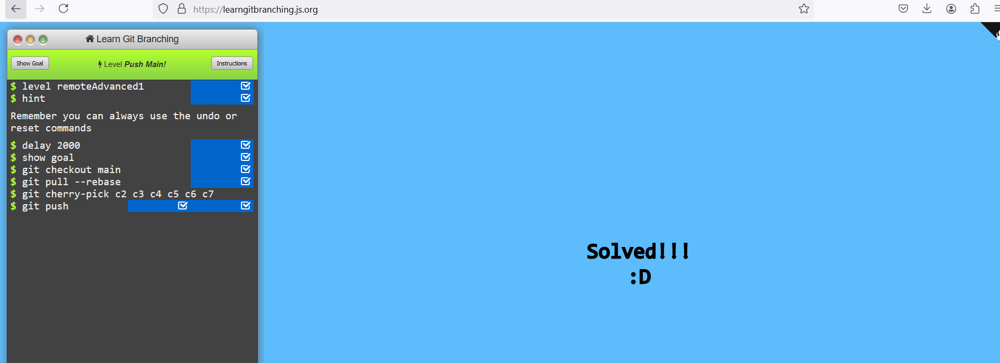
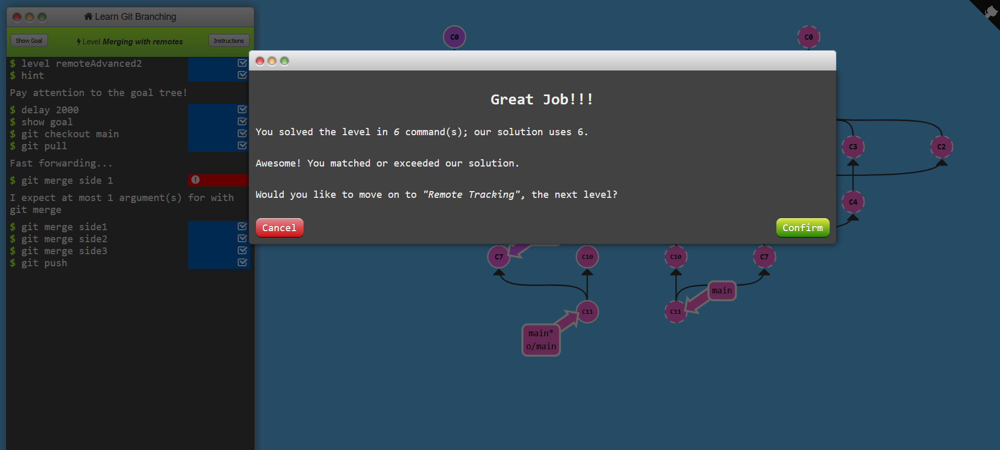
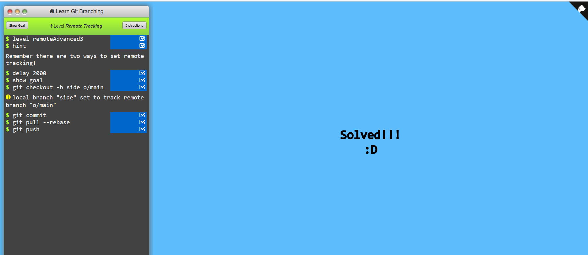

Level Locked Main

Solution-

git branch feature
git checkout feature
git branch-f main c1
git push

--------------------------------------------------------------------------------------------------------------------------------

Level Push Main

Solution:

git checkout main
git pull --rebase
git cherry-pick c2 c3 c4 c5 c6 c7
git push

--------------------------------------------------------------------------------------------------------------------------------

Level Merging with remotes

Solution:

git checkout main
git pull
git merge side1
git merge side2
git merge side3
git push

--------------------------------------------------------------------------------------------------------------------------------

Level Remote tracking

git checkout -b side o/main (it tracks side with o/main)

Solution:

git checkout -b side o/main
git commit
git pull --rebase
git push

--------------------------------------------------------------------------------------------------------------------------------

Level Git push arguments

'''git push origin main''', we are telling git what branch to look at to determine where the commits will come from, and where they are going to. Since we specified main as the parameter, git totally ignores where we are checked out when we run this command

Solution:

git push origin foo
git push origin main