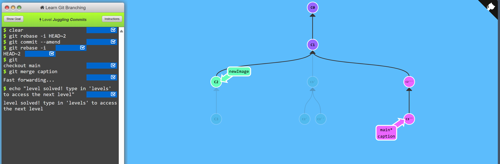
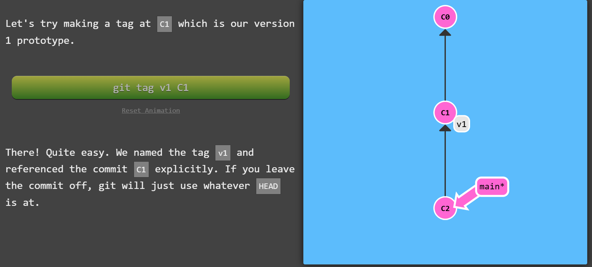

# 1. Locally Stacked Commits

**Problem:**<br>
- to track down bugs.
- for aid few debug commands & print statements are put in own commits.
- The only problem is to get ```bugFix``` into ```main``` to get all debug statements into main.


**Commands to be used:**<br>
```git rebase -i```<br>
```git cherry-pick```

**Solution:**<br>
```git checkout main```<br> ```git cherry-pick c4```


# 2. Juggling Commits

**Problem:**<br>
- You have some changes (newImage) and another set of changes (caption) that are related, so they are stacked on top of each other in your repository (aka one after another).
- to change the dimensions of newImage slightly, even though that commit is way back in our history

**Hint:**<br>
We will overcome this difficulty by doing the following:

- We will re-order the commits so the one we want to change is on top with ```git rebase -i```
- We will``` git commit --amend``` to make the slight modification
- Then we will re-order the commits back to how they were previously with ```git rebase -i```
- Finally, we will move main to this updated part of the tree to finish the level (via the method of your choosing)

**Solution:**<br>

- First git rebase and reorder c2 and c3.
- Then ammend the commit to make changes in c2.
- git rebase again to reorder the commits.
- checkout main
- git merge caption


# 3. Juggling Commits #2
Reordering the commits using git rebase might introduce rebase conflicts. So we use ```cherry-pick``` in this level.<br>

> Remember that git cherry-pick will plop down a commit from anywhere in the tree onto HEAD (as long as that commit isn't an ancestor of HEAD).

**Problem & goal:**
- amending C2 once but avoid using ```rebase -i```.


**Solution:**
- checkout main
- cherry-pick the c2 and ammend the commit
- cherry pick c3


# 4. Git Tags
Git tags are used to mark changes to the branch commits. We cannot checkout tags.


**Problem:**<br>
For this level just create the tags in the goal visualization and then check v1 out. Notice how you go into detached HEAD state -- this is because you can't commit directly onto the v1 tag:


**Solution:**<br>
- add git tag v1 to c2 using ```git tag v1 c2```
- add another tag to c1
- checkout tag on c2 by checking out c2


# 5. Git Describe
Because tags serve as such great "anchors" in the codebase, git has a command to describe where you are relative to the closest "anchor" (aka tag). And that command is called ```git describe```.

Git describe takes the form of:

```git describe <ref>```

Where ```<ref>``` is anything git can resolve into a commit. If you don't specify a ref, git just uses where you're checked out right now (HEAD).

The output of the command looks like:

```<tag>_<numCommits>_g<hash>```

Where tag is the closest ancestor tag in history, numCommits is how many commits away that tag is, and ```<hash>``` is the hash of the commit being described.

**Problem:**<br>


**Solution:**

- We can view tag v0 from main 
- tag v1 can be viewed from side and bugFix
- ```git describe bugFix/main/side```