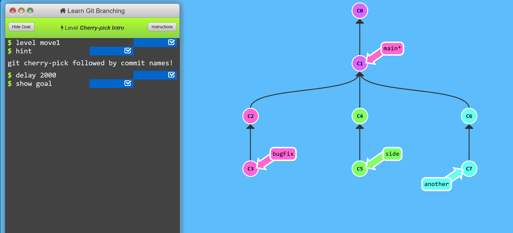

# Objective
To get comfortable with modifying source tree.

# 1. Cherry-pick intro
```git cherry-pick <Commit1> <Commit2> <...>``` <br>
**It's a very straightforward way of saying that you would like to copy a series of commits below your current location (HEAD).** <br>
It creates new commits introducing the copies from the branch we  want to copy. <br>

To complete this level, simply copy some work from the three branches shown into main. You can see which commits we want by looking at the goal visualization:

**Problem:**


**Solution:**
```git cherry-pick c3 c4 c7 ```


# 2. Git Interactive Rebase
This provides an interactive environment for yourself to pick and drop commits yourself. It is useful when you don't know whick commits to pick which to drop.<br>
```git rebase -i <commit-hash>```

When the interactive rebase dialog opens, you have the ability to do two things in our educational application:

- You can reorder commits simply by changing their order in the UI (via dragging and dropping with the mouse).
- You can choose to keep all commits or drop specific ones. When the dialog opens, each commit is set to be included by the ```pick``` button next to it being active. To ```drop``` a commit, toggle off its pick button.
<br>

Not only picking and dropping commits it is also used to ammending them, editing and combining commits.

 

To finish this level, do an interactive rebase and achieve the order shown in the goal visualization. Remember you can always undo or reset to fix mistakes:

**Problem & Goal:**


**Solution:**<br>
```git rebase -i HEAD~4 ```
A UI appears delete C2 and move C4 below C5.


