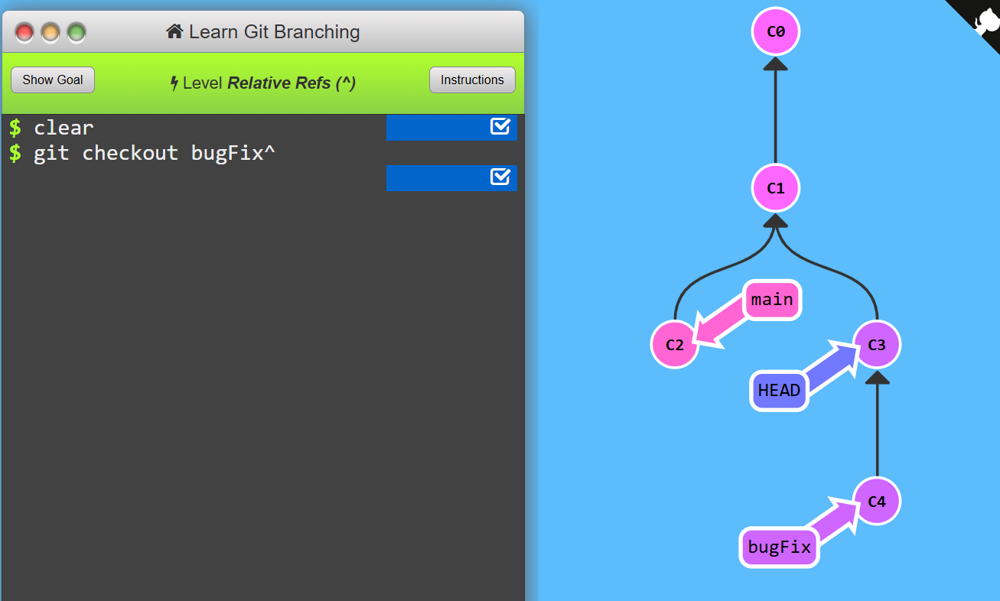
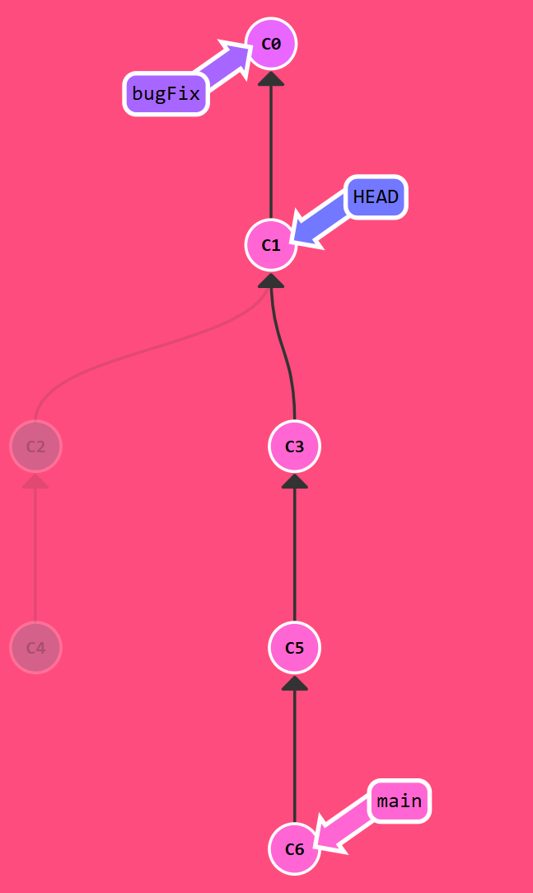
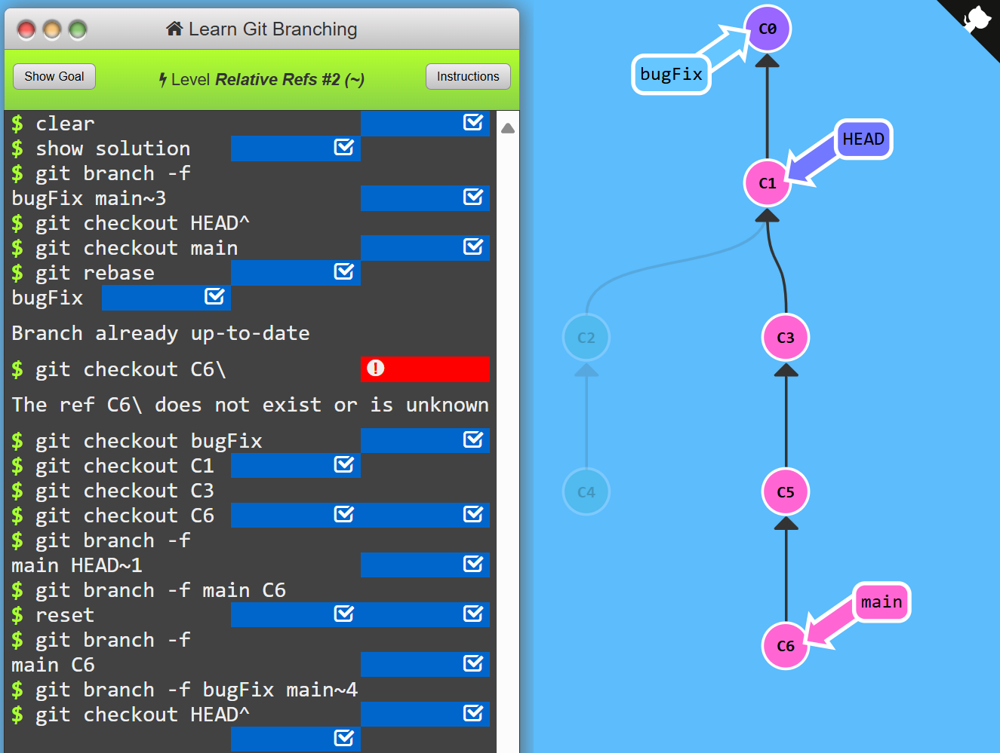
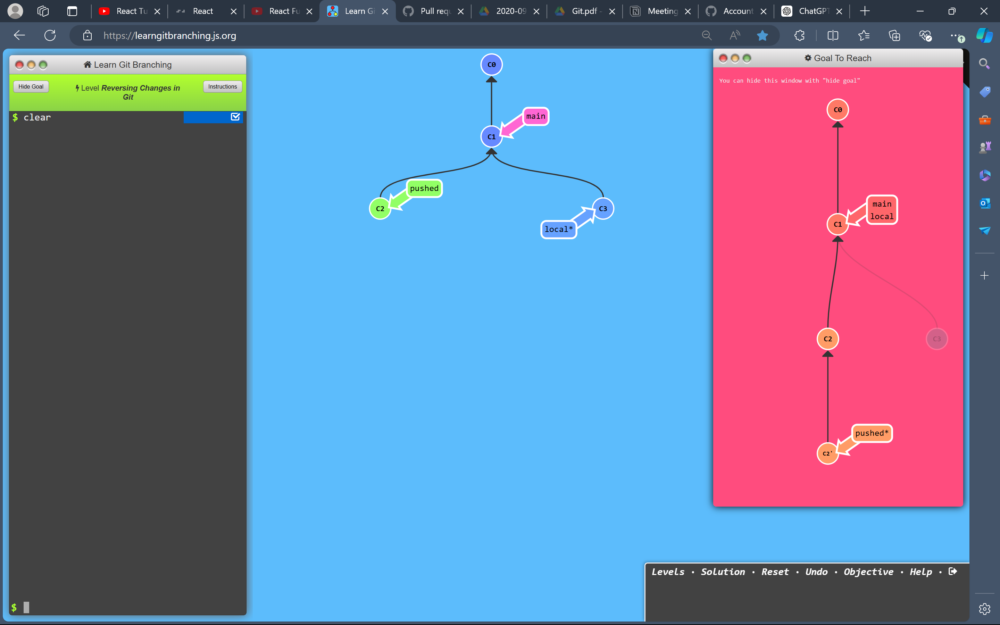
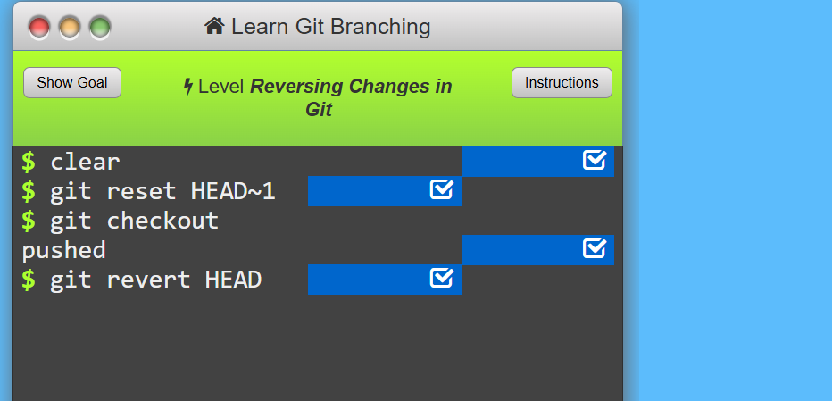

# 1. Detach yo head
Includes moving around in git. <br>
First we have to talk about "HEAD". HEAD is the symbolic name for the currently checked out commit -- **it's essentially what commit you're working on top of.**<br>
HEAD always points to the most recent commit which is reflected in the working tree. Most git commands which make changes to the working tree will start by changing HEAD.
Head points to a branch. When you commit change is visible.
<br>

**Detaching HEAD**
Detaching HEAD just means attaching it to a commit instead of a branch. This is what it looks like beforehand:

```HEAD -> main -> C1```
```git checkout C1```
And now it's
```HEAD -> C1```<br>

To complete this level, let's detach HEAD from bugFix and attach it to the commit instead.


# 2. Relative Refs
Specifying commits by their hash isn't the most convenient thing ever, which is why Git has **relative refs**. They are awesome!

With relative refs, you can start somewhere memorable (like the branch bugFix or HEAD) and work from there.

Relative commits are powerful, but we will introduce two simple ones here:

- Moving upwards one commit at a time with ^
- Moving upwards a number of times with ```~<num>```<br>

Each time you append ^ to a ref name, you are telling Git to find the parent of the specified commit.

So saying ``main^`` is equivalent to "the first parent of main".

main^^ is the grandparent (second-generation ancestor) of main.

You can also reference HEAD as a relative ref. checking out to commit and using relative ref help to move up the tree.<br>

To complete this level, check out the parent commit of bugFix. This will detach HEAD:


# 3. Relative Ref 2
**The "~" operator**<br>
It might be tedious to type ^ several times, so Git also has the tilde (~) operator. The tilde operator (optionally) takes in a trailing number that specifies the number of parents you would like to ascend.

**Branch forcing**<br>
One of the most common ways I use relative refs is to move branches around. You can directly reassign a branch to a commit with the -f option. So something like:

```git branch -f main HEAD~3```

To complete this level, move HEAD, main, and bugFix to their goal destinations shown:
**Goal:**


**Solution:**<br>



# 4. Reversing Changes in Git

There are two primary ways to undo changes in Git: one is using ```git reset``` and the other is using ```git revert```.<br>

**```git reset```** reverses changes by moving a branch reference backwards in time to an older commit. In this sense you can think of it as "rewriting history;" **git reset will move a branch backwards as if the commit had never been made in the first place.** 

While resetting works great for local branches on your own machine, its method of "rewriting history" doesn't work for remote branches that others are using.
<br>

In order to reverse changes and share those reversed changes with others, we need to use git revert.

A new commit will be added to introduce the changes that took place. The new commit introduces commit that exactly reverses the older commit.

**With reverting, you can push out your changes to share with others**.

To complete this level, reverse the most recent commit on both local and pushed. You will revert two commits total (one per branch).


**Solution:** 