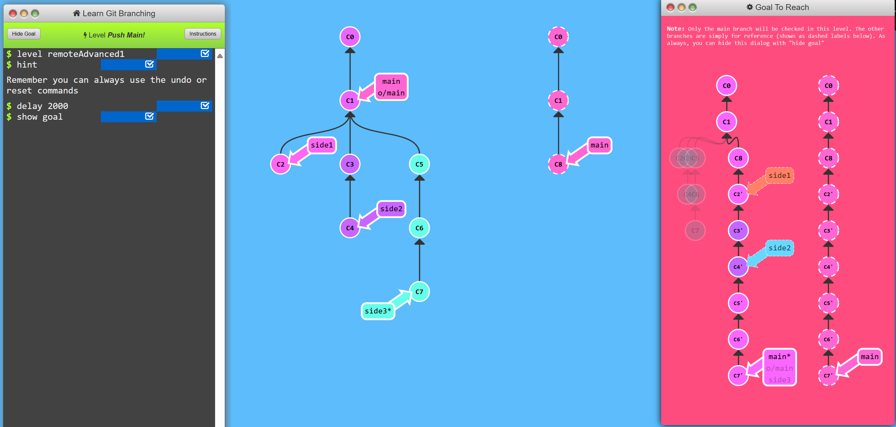
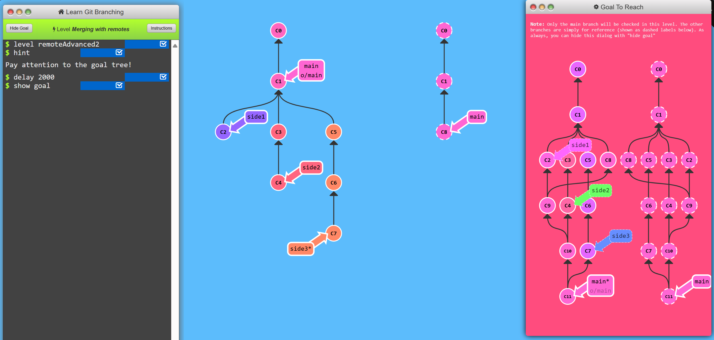
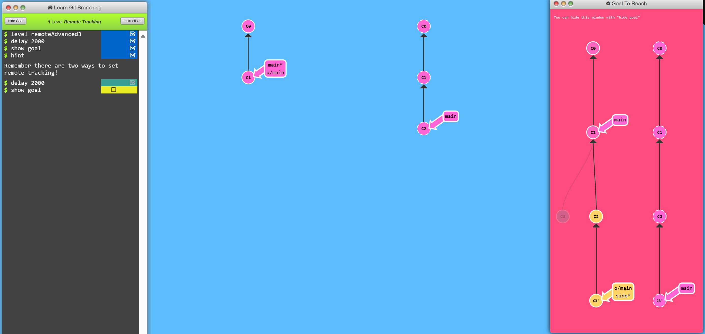
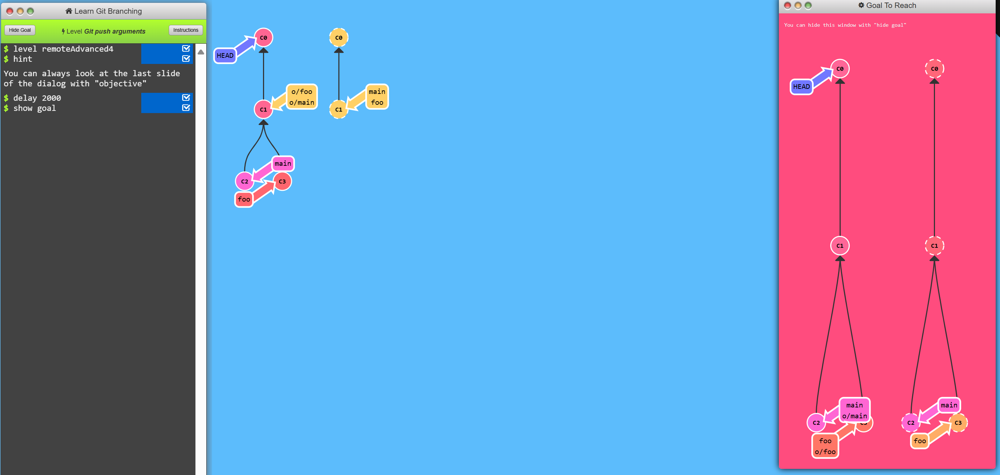
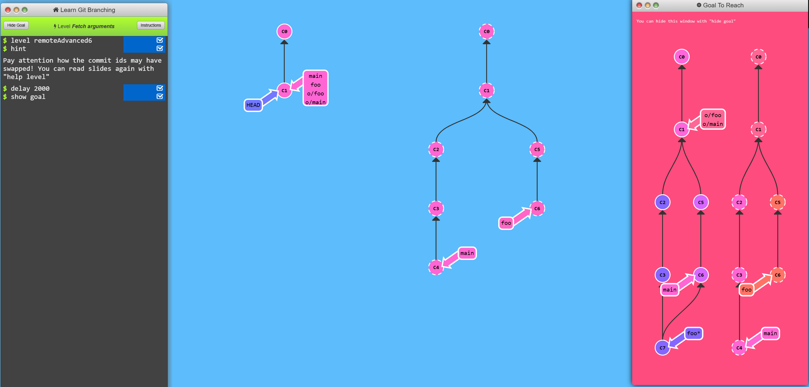
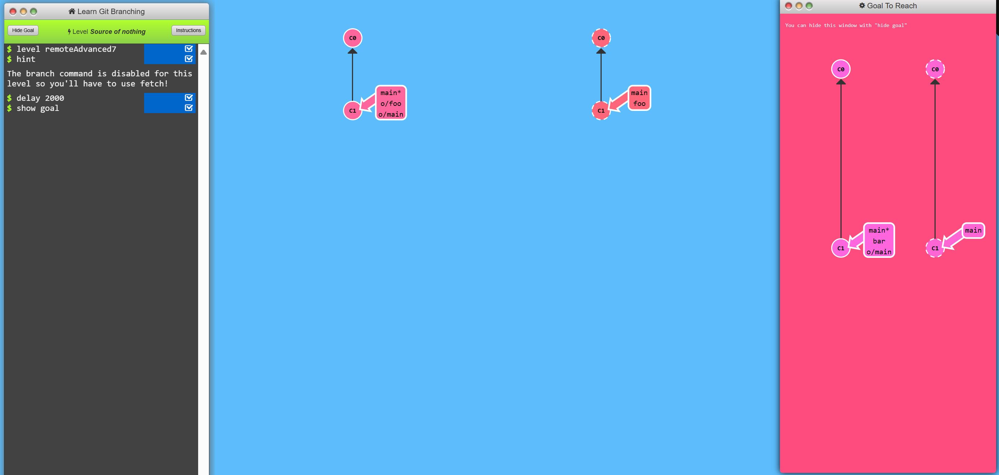
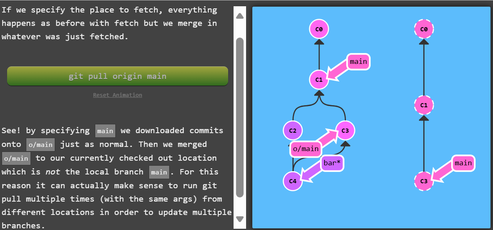
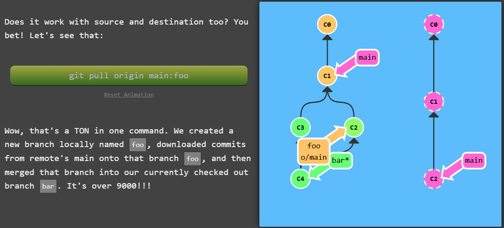
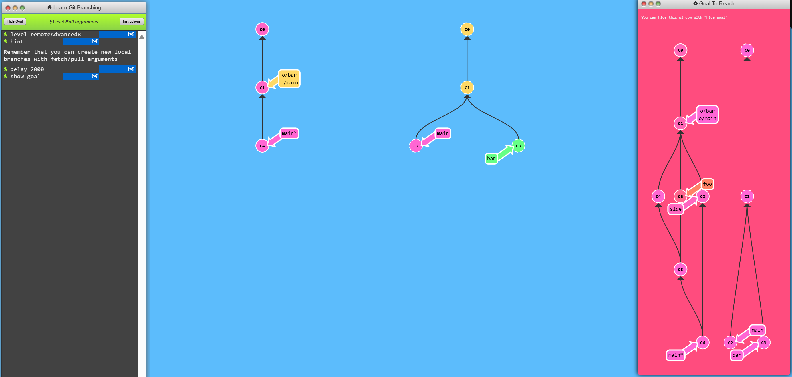

# 1. Merging Feature branches
This level is pretty hefty -- here is the general outline to solve:

- There are three feature branches -- ```side1``` ```side2``` and ```side3```
- We want to push each one of these features, in order, to the remote
- The remote has since been updated, so we will need to incorporate that work as well

**Problem and goal:**<br>



**Solution:**<br>
- first pull the changes in remote branches to main branch ```git checkout main; git pull --rebase```
- now rebase the changes in side branches sequentially side1, side2 and then side3
```git checkout side1; git rebase main```
- rebase the other side braches to respective previous branches
- merge side branches to main branch ```git checkout main; git merge side1```
- push the changes from main

# 2. Merging with remotes
In order to push new updates to the remote, all you need to do is incorporate the latest changes from the remote. That means you can either **rebase** or **merge** in the remote branch (e.g. o/main).

<h2> Tradeoff between merge and rebase</h2>
There's a lot of debate about the tradeoffs between merging and rebasing in the development community. Here are the general pros / cons of rebasing:

- Pros:

    - Rebasing makes your commit tree look very clean since everything is in a straight line
- Cons:

    - Rebasing modifies the (apparent) history of the commit tree.


>Merging preserves history of commits. While rebasing helps for clean commit tree.

>That is why, it all comes down to preferences.

**Problem:**<br>
For this level, let's try to solve the previous level but with merging instead. It may get a bit hairy but it illustrates the point well.


**Solution:**<br>
- checkout main branch and pull the changes in remote branch using ```git pull rebase```
- merge the main branch with each of the side branches using ```git merge side1``` and continue
- finally push the changes in local repo to remote repo using ```git push```

# 3. Remote Tracking branches
The ```main``` branch is related to ```o/main```, this connection is demonstrated by:
- During pull op, commits are downloaded into o/main and then merged into main branch. **The target of merge is determined from this connection.**
- During push op, work from main branch are pushed into remote's main branch. **The destination of push is determined by the connection between main & o/main.**
<h2>Remote Tracking</h2>

The connection between main and o/main is simply explained simply by "remote tracking" property of branches.

>The main branch is set to track o/main -- this means there is an implied merge target and implied push destination for the main branch.


<h2>Can I specify this myself?</h2>

Yes you can! You can make any arbitrary branch track o/main, and if you do so, that branch will have the same implied push destination and merge target as main. **This means you can run git push on a branch named ```totallyNotMain``` and have your work pushed to the main branch on the ```remote```!**
<br>

There are 2 ways to do that:
- checkout new branch by using a remote branch as specified ref
```git checkout -b totallyNotMain o/main``` <br>
creates new branch names ```totallyNotMain``` and sets it to track ```o/main```.
- Another way is to ret remote tracking directlu using ```git branch -u o/main totallyNotMain``` <br>
will set the foo branch to track o/main. If foo is currently checked out you can even leave it off:
```git branch -u o/main```


**Problem:**<br>
For this level let's push work onto the main branch on remote while not checked out on ```main``` locally. You should instead a branch named ```side``` which the goal diagram will show.


**Solution:**<br>
- make your side branch to track remote branch o/main using any of the above two method.
- add a new commit
- pull and rebase the changes in remote using ```git pull --rebase```
- push the changes


# 4. Push arguments
Git push takes arguments in the form of:<br>
```git push <remote> <place>``` e.g. 
```git push origin main```
<br>
<h3>What this does is?<h3/>

Go to the branch named "main" in my repository, grab all the commits, and then go to the branch "main" on the remote named "origin". Place whatever commits are missing on that branch and then tell me when you're done.
<br>

```<place>``` parameter is used to synchronize between two repos. By specifying main as the "place" argument, we told git where the commits will come from and where the commits will go.

After we gave git, everything it needs to know it ignores where we are checked out. 

**Problem:**<br>
For this level let's update both ```foo``` and ```main``` on the remote. The twist is that git checkout is disabled for this level.


**Solution:**<br>
To solve this level:
- push main with ```git push origin main```
- push foo with ```git push origin foo```

# 5. ```<place>``` argument details
We can specify source and destination using git push. In order to specify both the source and the destination of ```<place>```, simply join the two together with a colon:<br>
```git push origin <source>:<destination>```
<br>
This is commonly referred to as a colon refspec. Refspec is just a fancy name for a location that git can figure out (like the branch foo or even just HEAD~1).

**Problem:**<br>

For this level, try to get to the end goal state shown in the visualization, and remember the format of:
```<source>:<destination>```


**Solution:**<br>
- push the foo branch just ahead of main branch using ```git push origin main^:foo```
- push the main branch with source foo branch
```git push origin foo:main```

# 6. Git fetch arguments

The arguments for git fetch are actually very, very similar to those for git push. **It's the same type of concepts but just applied in the opposite direction.**
</br>
<h3>
The place parameter </h3>

If you specify a place with git fetch like in the following command

```git fetch origin foo```

Git will go to the foo branch on the remote, grab all the commits that aren't present locally, and then plop them down onto the o/foo branch _**not foo branch**_ locally. <br>
It doesn't plops commits on foo branch because it makes exception for us to work on the things that are already on foo branch

However we can directly plop commits on destination branch using ```<source>:<destination>```<br>
``<source>`` is now a place on the remote and ``<destination>`` is a local place to put those commits. **(opposite of git push)**. <br>
Even if the destination doesn't exists before we run the command it will create the destination and plop the commits on the destination branch. 
<br>

>If git fetch receives no arguments, it just downloads all the commits from the remote onto all the remote branches.

**Problem:**<br>
To finish this level, fetch just the specified commits in the goal visualization. Get fancy with those commands:
>You will have to specify the source and destination for both fetch commands. Pay attention to the goal visualization since the IDs may be switched around!




**Solution:**<br>
- fetch the commits (upto c3) on main branch to foo branch using ```git fetch origin c3:foo```
- fetch the commits on foo branch to main branch using ```git fetch origin c6:main```
- checkout to foo branch 
- merge to the main branch


# 7. Source of nothing<h3>
**Oddities of ```<source>``` :**</h3><br>
We can specify ```nothing``` as valid source for both ```git push``` and ```git fetch```:
- ```git push origin :side```
- ```git fetch origin :bugFix```
<br>
<br>

**Problem:**<br>
This is a quick level, just delete one remote branch and create a new branch with git fetch to finish:



**Solution:**<br>
- push the foo branch with nothing source to delete branch from remote. 
```git push origin :foo```
- fetch a new branch with nothing source to create on local. ```git fetch origin :bar   ```

# 8. Git pull arguments
Here are some equivalent commands in git:

- ```git pull origin foo``` is equal to:

- ```git fetch origin foo; git merge o/foo```

And...

- ```git pull origin bar:bugFix``` is equal to:

- ```git fetch origin bar:bugFix; git merge bugFix```

git pull is really just shorthand for _**fetch + merge**_, and all git pull cares about is where the commits ended up (the destination argument that it figures out during fetch).






**Problem:**<br>
Attain the state of the goal visualization. 
> You'll need to download some commits, make some new branches, and merge those branches into other branches, but it shouldn't take many commands 



**Solution:**<br>
- pull the specific commit c3 using ```git pull origin c3:foo``` c3 will be commited to branch foo and merged with currently checked out branch i.e. main
- pull commit c2 using ```git pull origin c2:side``` and this completes level


