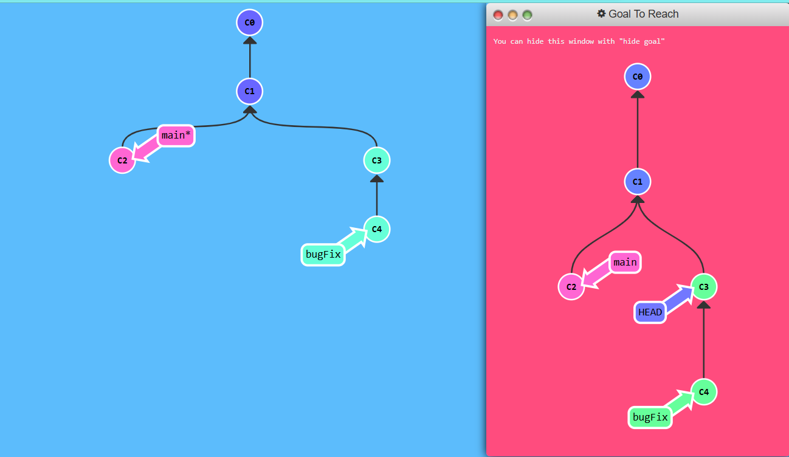

# Github writeups

Link : https://learngitbranching.js.org/

# You can see all the commands available with show commands at the terminal.

# Introduction Sequence

## Level : Introduction to Git Commits
- A commit in a git repository records a snapshot of all the (tracked) files in your directory. It's like a giant copy and paste, but even better!.
- Git also maintains a history of which commits were made when, so most commits have ancestor commits above them.
- Git keeps commits lightweight by compressing them as a set of changes from one version to the next, instead of copying the entire directory every time.

### Goal to reach


**Just type in "git commit" twice to finish!**

```bash
$ git commit
$ git commit
```

## Level : Branching in Git
- Branches in Git are incredibly lightweight as well.They are simply pointers to a specific commit.
- This is why many Git enthusiasts chant the mantra:
```
branch early, and branch often
```
- A branch includes the work of its commit and all parent commits.
- When we start mixing branches and commits, we will see how these two features combine. For now though, just remember that a branch essentially says "I want to include the work of this commit and all parent commits."

- In Git version 2.23, a new command called `git switch` was introduced to eventually replace `git checkout`, which is somewhat overloaded (it does a bunch of different things depending on the arguments)

### Goal to reach
- Make a new branch with "git branch " and check it out with "git checkout "


- If you want to create a new branch AND check it out at the same time, you can simply type:
`git checkout -b [yourbranchname]`

### To solve
```
git checkout -b bugFix
```

## Level 3 : Merging in git
- After learning how to commit and branch, the next step is combining work from different branches. This allows us to develop new features separately and then integrate them back into our main branch.
- Using git merge, we create a special commit with two unique parents. This commit effectively incorporates changes from two branches, along with their entire histories, into one cohesive unit. This process streamlines collaborative development and maintains project organization.

### Goal to reach


### To complete this level, do the following steps:
- Make a new branch called `bugFix`
- Checkout the `bugFix` branch with `git checkout bugFix`
- Commit once
- Go back to `main` with `git checkout`
- Commit another time
- Merge the branch `bugFix` into `main` with `git merge`

```bash
$ git checkout -b bugFix
$ git commit
$ git checkout main
$ git commit
$ git merge bugFix
```

## Level 4 : Rebase Introduction
- Another way to combine work between branches is `git rebase`. Rebasing takes a set of commits, "copies" them, and applies them elsewhere.
- The advantage of rebasing is that it can be used to make a nice linear sequence of commits.
- The commit log / history of the repository will be a lot cleaner if only rebasing is allowed.

### Goal


### To complete this level, do the following

- Checkout a new branch named `bugFix`
- Commit once
- Go back to main and commit again
- Check out bugFix again and rebase onto main

```bash
$ git checkout -b bugFix
$ git commit
$ git checkout main
$ git commit
$ git checkout bugFix
$ git rebase main
```

### Ramping Up

##Level 1 : Detach yo' HEAD

## Head
- In Git, "HEAD" is the symbolic reference to the current commit you're working on. It points to the latest commit in your working directory. Most Git commands that modify the working directory start by updating HEAD.

- Typically, HEAD points to a branch name (e.g., bugFix). When you make a commit, it updates the branch's status, which is reflected by HEAD.

- Detaching HEAD just means attaching it to a commit instead of a branch.
- This is what it looks like beforehand:HEAD -> main -> C1 then perform `git checkout c1` And now it's HEAD -> C1.

### Goal to reach


### To solve this level 
- To complete this level, let's detach HEAD from bugFix and attach it to the commit instead.

```
git checkout c4
```

## level 2: Relative Refs (^)

- Navigating Git using commit hashes can be cumbersome, especially since you don't have a visual commit tree in the terminal. You'll need to use git log to view these hashes.

- Hashes in Git are long and complex, like `fed2da64c0efc5293610bdd892f82a58e8cbc5d8`. However, Git allows you to use shortened versions of these hashes. You only need to type enough characters to uniquely identify the commit, such as `fed2` instead of the full hash.

- specifying commits by their hash isn't the most convenient thing ever, which is why Git has relative refs.

- Relative commits are powerful, but we will introduce two simple ones here:

- Moving upwards one commit at a time with `^`
- Moving upwards a number of times with `~<num>`


### Goal to reach



### To solve this level
- To complete this level, check out the parent commit of bugFix. This will detach HEAD.

- So saying bugFix^ is equivalent to "the first parent of main".

## to solve type
```
git checkout C4
```

## level 3: Relative Refs #2 (~)

# `~` operator
- The `~` operator in Git lets you move up multiple levels in the commit tree easily by specifying a number, like `git checkout HEAD~3` to go up three commits, instead of using ^ repeatedly.

### Branch forcing
- Branch forcing allows you to reassign a branch to a different commit using relative references. For example, `git branch -f main HEAD~3` forcefully moves the main branch to the commit three levels up from HEAD. Note: In a real Git environment, you cannot use git branch -f on the current branch.

### Goal to reach


### To solve this level
- To complete this level, move `HEAD`, `main`, and `bugFix` to their goal destinations shown.

```
git branch -f main C6
git branch -f bugFix C0
git checkout C2^
```

## level 4: Reversing Changes in Git
- There are many ways to reverse changes in Git.And just like committing, reversing changes in Git has both a low-level component (staging individual files or chunks) and a high-level component (how the changes are actually reversed).

- There are two primary ways to undo changes in Git -- one is using git reset and the other is using git revert.

### Git reset
- git reset reverses changes by moving a branch reference backwards in time to an older commit. In this sense you can think of it as "rewriting history;" git reset will move a branch backwards as if the commit had never been made in the first place.`git reset HEAD~1`

### Git revert
- While resetting works great for local branches on your own machine, its method of "rewriting history" doesn't work for remote branches that others are using.
- In order to reverse changes and share those reversed changes with others, we need to use `git revert`.
- `git revert HEAD`

### Goal to reach


### To solve this Level
- To complete this level, reverse the most recent commit on both local and pushed. You will revert two commits total (one per branch).

```
$ git reset local~1

$ git checkout pushed

$ git revert pushed
```


## Moving Work Around

# Level 1 : Cherry-pick Intro

`"I want this work here and that work there"`

`git cherry-pick <Commit1> <Commit2> <...>`
- It's a very straightforward way of saying that you would like to copy a series of commits below your current location (HEAD).

`git cherry-pick C2 C4`

### Goal to reach


### To solve this lab
- To complete this level, simply copy some work from the three branches shown into main. You can see which commits we want by looking at the goal visualization.

```
git cherry-pick C3 C4 C7
```

# Level 2 : Interactive Rebase Intro
- Git cherry-pick is ideal for applying specific commits when you know their hashes. For situations where you don't know which commits to pick, interactive rebasing lets you review and select commits during the rebase process.
- Interactive rebase in Git uses the `rebase -i` command

`git rebase -i HEAD~4`

- To finish this level, do an interactive rebase and achieve the order shown in the goal visualization.

### Goal to reach


### To solve this level

```
git rebase -i HEAD~4
```
