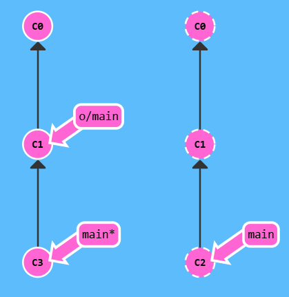
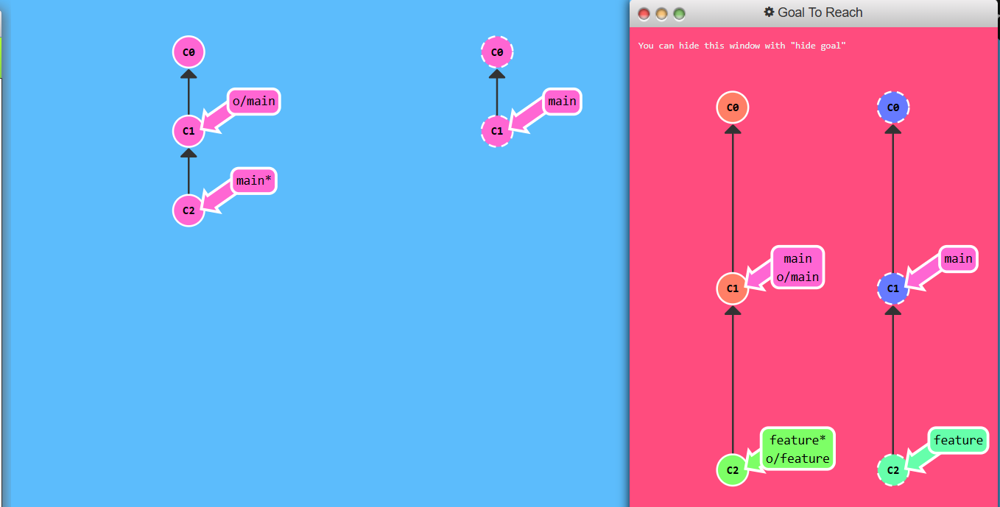

## Push & Pull -- Git Remotes!

## level 1 : Clone Intro

## Git Remotes
1. Remote repositories are simply copies of your repository on another computer, accessible via the Internet for transferring commits.
2. They offer great benefits, such as serving as backups and enabling collaboration.
3. Websites like GitHub use remotes to visualize activity, making it crucial to understand them.

# <h1>GIt Clone<h1>
`git clone` creates local copies of remote repositories (like from GitHub).


To `finish` this level, simply `git clone` your existing repository.

## Level 2. Remote Branches
1. Remote branches reflect the state of remote repositories
2. They help differentiate between your local work and public work, which is crucial before sharing updates.
3. Remote branches have the special property that when you check them out, you are put into detached `HEAD` mode.
4. Git does this on purpose because you can't work on these branches directly; you have to work elsewhere and then share your work with the remote.
`Remote branches are on your local repository, not on the remote repository.`

What is o/?
- ```<remote name>/<branch name>```
- for branch o/main, the branch name is ```main``` and remote is ```o```.<br>


To finish this level, commit once off of main and once after checking out o/main. This will help drive home how remote branches behave differently, and they only update to reflect the state of the remote.<br>

### Solution
```
$ git commit

$ git checkout o/main

$ git commit
```

## level 3 : GIt fetchin'
1. Working with git remotes essentially involves transferring data to and from other repositories.As long as we can send commits back and forth, we can share any type of update tracked by git, including work, new files, ideas, and more.
2. In this lesson, we will learn how to fetch data from a remote repository using the `git fetch` command. When we fetch data, our representation of the remote repository is updated, and our remote branches will reflect these updates.

What **Fetch** does?
`git fetch` performs two main steps:
- Downloads missing commits from the remote repository.
- Updates our remote branch pointers (e.g.,`o/main`).
- This command synchronizes our local repository with the remote's current state, updating our remote branches to reflect the latest changes. `git fetch` communicates with the remote repository over the Internet, using protocols like `http://` or `git://.`

What **git fetch** Doesn't Do?
- git fetch does not change your local state. It won't update your main branch or alter your file system.
- This is crucial because many developers mistakenly believe that git fetch will make their local work reflect the remote's state. While it downloads the necessary data, it doesn't change your local files. Commands to update your local files will be covered in later lessons.
- In essence, think of git fetch as a download step.


### Goal to reach


### To solve this level
To finish the level, simply `git fetch` and download all the commits!
```
$ git fetch 
```

## Level 4 : Git Pullin'
1. The workflow of fetching remote changes and then merging them is so common that git actually provides a command that does both at once! That command is `git pull`.

### Goal to reach


### To solve this level
you can actually solve this level with just `fetch` and `merge`, but it will cost you an extra command :P
```
git pull
```


## Level 5 : Faking Teamwork
- This level includes a aptly-named command ```git fakeTeamwork```
- The default behavior of fakeTeamwork is to simply plop down a commit on main.


### Goal to reach


### To solve this level
Go ahead and make a remote (with git clone), fake some changes on that remote, commit yourself, and then pull down those changes. It's like a few lessons in one!

```
$ git clone

local branch "main" set to track remote branch "o/main"

$ git fakeTeamwork 2

$ git fetch

$ git commit

$ git merge o/main
```

## Level 6: Git Pushin'
- git push is responsible for uploading your changes to a specified remote and updating that remote to   incorporate your new commits.
- after push remote branch and main branch should be at same place
### To solve this level
To finish this level, simply share two new commits with the remote.
```
$ git commit

$ git commit

$ git push
```

## Level 7: Diverged History
- when the remote branch is already ahead of your local branch we cannot push the changes to it, or it doesn't allow because the changes would be ambigious.

- When we `git push` nothing will happen because the command fails. `git push` fails because your most recent commit `C3` is based off of the remote at `C1`. The remote has since been updated to `C2` though, so git rejects your push.
- **How do you resolve this situation?** It's easy, all you need to do is base your work off of the most recent version of the remote branch.
- There are a few ways to do this, but the most straightforward is to move your work via rebasing.
- rebase before pushing.

```
git rebase o/main
git push
```

## another solution ig `merge`
- we fetch first like in previous method.
- merge the changes to remote branch
- push the changes
```
git fetch
git merge o/main
git push
```
- another way is, `git pull` is just shorthand for a **fetch** and a **merge**. Conveniently enough, `git pull --rebase` is shorthand for a fetch and a rebase!.

# In order to solve this level, take the following steps:
- Clone your repo
- Fake some teamwork (1 commit)
- Commit some work yourself (1 commit)
- Publish your work via rebasing
```
$ git clone

$ git fakeTeamwork

$ git commit

$ git pull --rebase

$ git push
```


## Level 8:  Locked Main
- If you work on a large collaborative team it's likely that main is locked and requires some Pull Request process to merge changes. If you commit directly to main locally and try pushing you will be greeted with a message similar to this:

`! [remote rejected] main -> main (TF402455: Pushes to this branch are not permitted; you must use a pull request to update this branch.)`

# Why was it rejected ?
- the policy is to require pull requests instead of directly pushing commits to main - **cause of error:** somehow you did push directly on main without creating a branch and sending a pull request

## The solution
- Create another branch called feature and push that to the remote. Also reset your main back to be in sync with the remote otherwise you may have issues next time you do a pull and someone else's commit conflicts with yours.



```
git reset HEAD~1
git checkout -b feature C2
git push
```