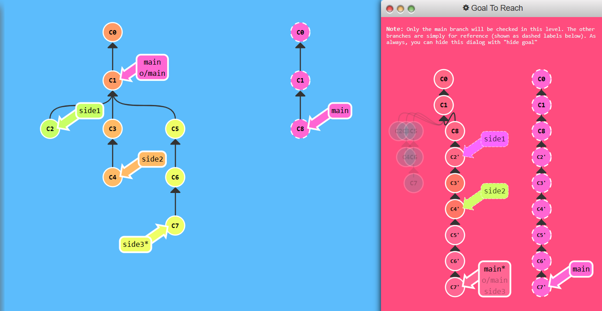
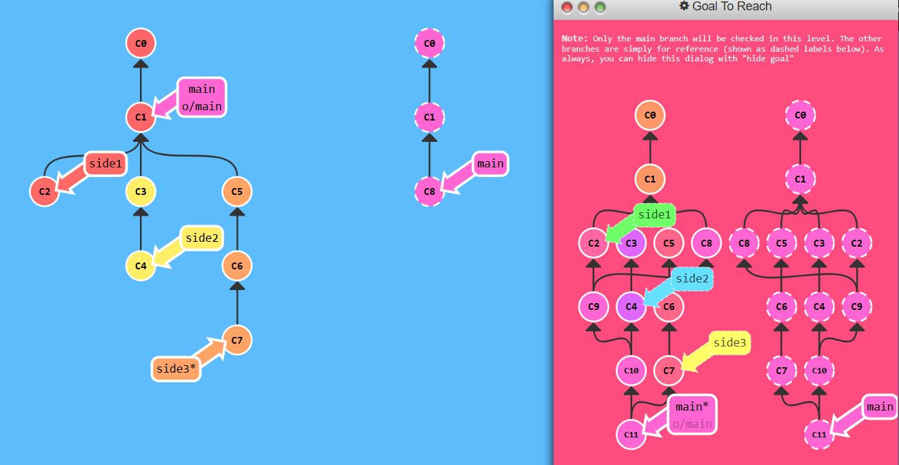
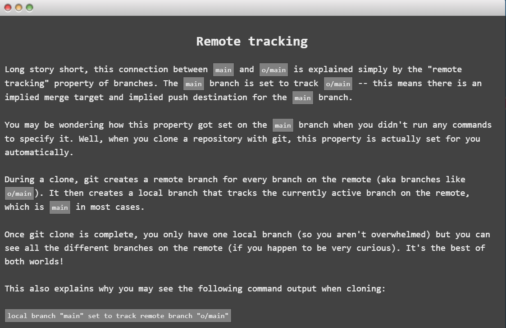
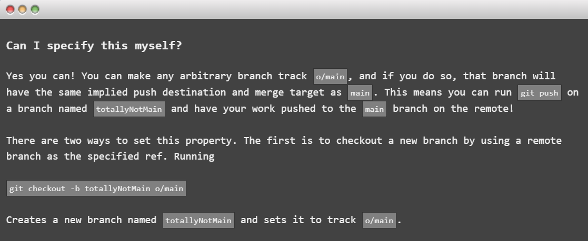
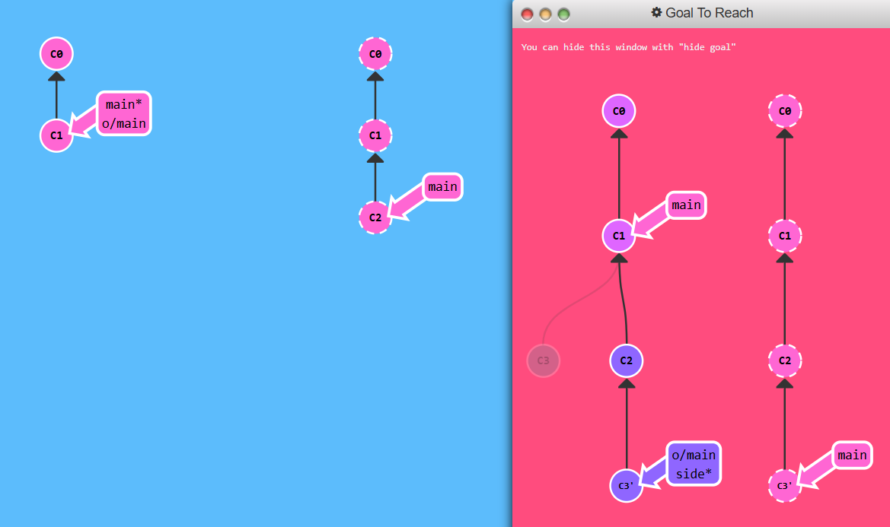
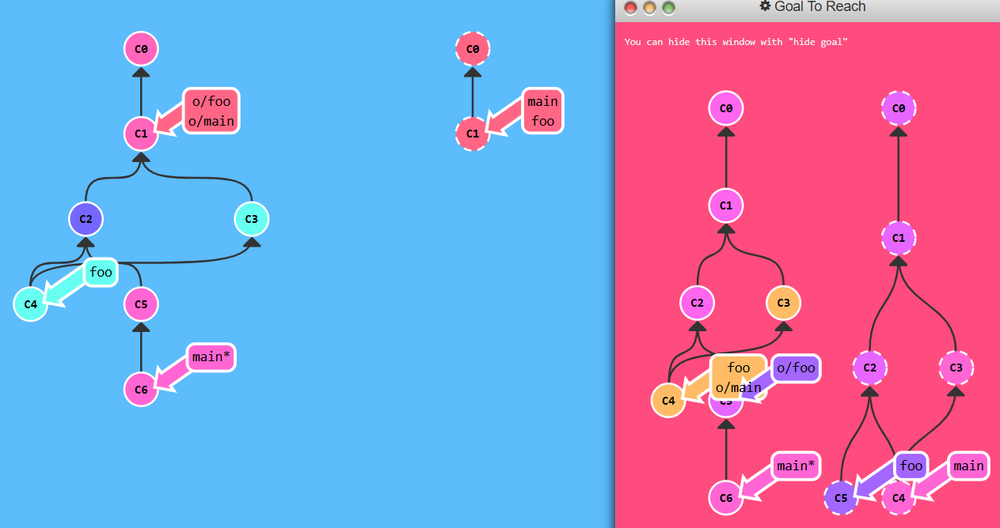
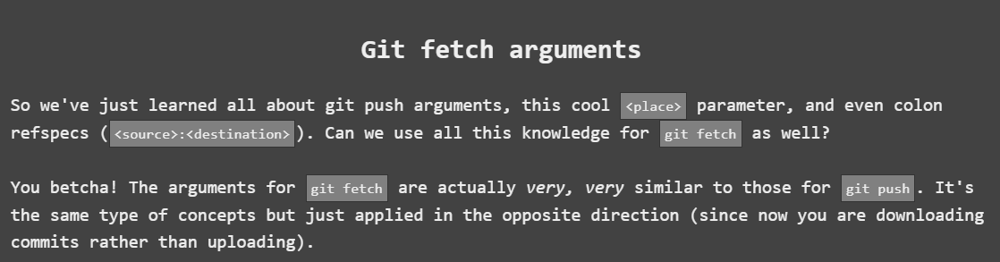
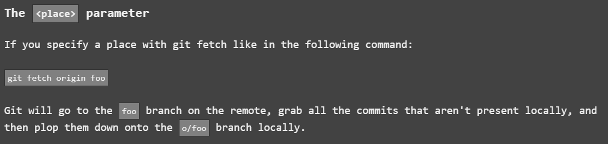
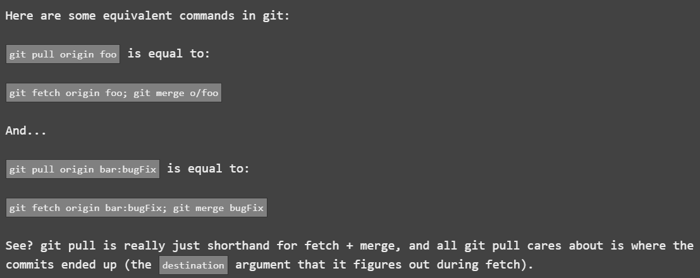

### 1: Push Main!

## To solve


```
git checkout main

$ git pull --rebase

$ git checkout side1

$ git rebase main

$ git checkout side2

$ git rebase side1

$ git checkout side3

$ git rebase side2

$ git checkout main

$ git merge side3

$ git push
```
`:D`

## 2 : Merging with remotes
- In order to push new updates to the remote, all you need to do is incorporate the latest changes from the remote. That means you can either **rebase** or **merge** in the remote branch (e.g. o/main).
- There's a lot of debate about the tradeoffs between merging and rebasing in the development community. Here are the general pros / cons of rebasing:
**Pros:**
-Rebasing makes your commit tree look very clean since everything is in a straight line
**Cons:**
- Rebasing modifies the (apparent) history of the commit tree.
- Merging preserves history of commits. While rebasing helps for clean commit tree.

- That is why, it all comes down to preferences.




### Solution
```
$ git checkout main

$ git pull

Fast forwarding...

$ git merge side1

$ git merge side2

$ git merge side3

$ git push
```


## 3 : Remote Tracking
- Remote-tracking branches in Git automatically track the state of branches on a remote repository. The connection between a local branch (like `main`) and its remote counterpart (e.g.,` o/main`) is crucial during operations:
1. During pull op, commits are downloaded into o/main and then merged into main branch. **The target of merge is determined from this connection.**
2. During push op, work from main branch are pushed into remote's main branch. **The destination of push is determined by the connection between main & o/main.**




- Another way is to ret remote tracking directlu using git branch `-u o/main totallyNotMain`
will set the foo branch to track o/main. If foo is currently checked out you can even leave it off: `git branch -u o/main`

### Goal to reach
- For this level let's push work onto the main branch on remote while not checked out on main locally. You should instead a branch named side 



### To solve this level
```
git checkout -b side o/main
git commit
git pull --rebase
git push
```

## 4: Git push arguments
- git push can optionally take arguments in the form of:
`git push <remote> <place>`

**Issuing the command:**
`git push origin main`

- Translates to this in English:

- Go to the branch named **"main"** in my repository, grab all the commits, and then go to the branch "main" on the remote named **"origin"**. Place whatever commits are missing on that branch and then tell me when you're done.
- By specifying main as the "place" argument, we told git where the commits will come from and where the commits will go. It's essentially the "place" or "location" to synchronize between the two repositories.

### Problem:
For this level let's update both foo and main on the remote. The twist is that git checkout is disabled for this level.

## solution
```
$ git push origin main

$ git push origin foo
```


## 5 :  Git push arguments -- Expanded!
- If we want the source and destination to be different to do so, we simple join two place separated by the semi-colon `git push origin <source>:<destination>`. If branch is absent it creates new one.
- This is commonly referred to as a colon refspec. Refspec is just a fancy name for a location that git can figure out (like the branch foo or even just HEAD~1).
- To solve this level


```
$ git push origin main~1:foo

$ git push origin foo:main
```

## 6 :  Fetch arguments



### To solve this level
```
$ git fetch origin C3:foo

$ git fetch origin C6:main

$ git checkout foo

$ git merge main
```

## 7 :  Source of nothing
- What does pushing "nothing" to a remote branch do? **It deletes it!**
- `git push origin :foo`
- There, we successfully deleted the `foo` branch on remote by pushing the concept of "nothing" to it.
- fetching "nothing" to a place locally actually makes a new branch.
`git fetch origin :bar`

## To solve this level
```
git push origin :foo
git fetch origin :bar
```


## 8 :  Pull arguments


## To solve this level
```
git pull origin C3:foo
git pull origin C2:side
```

